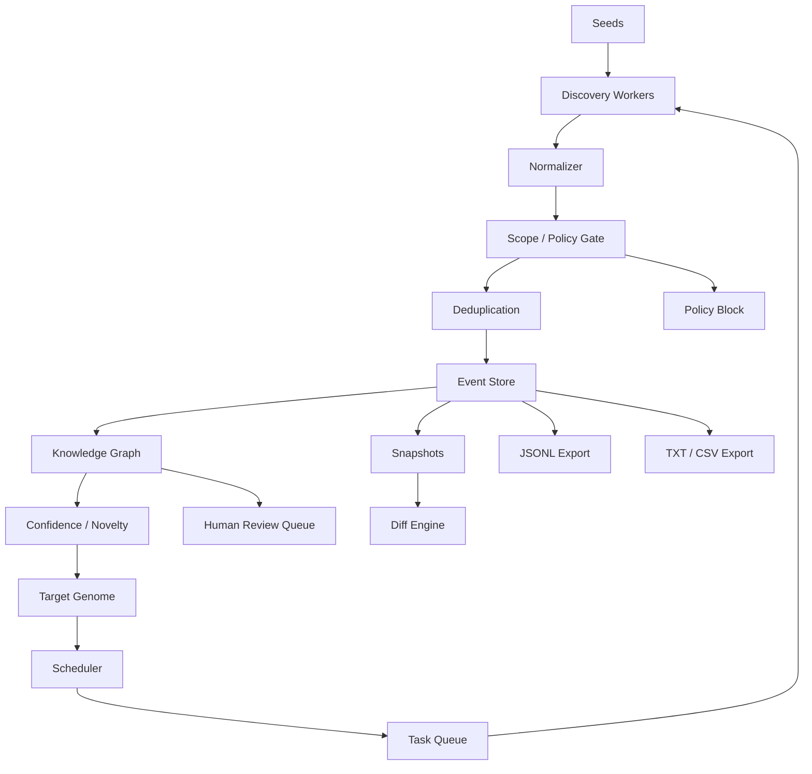
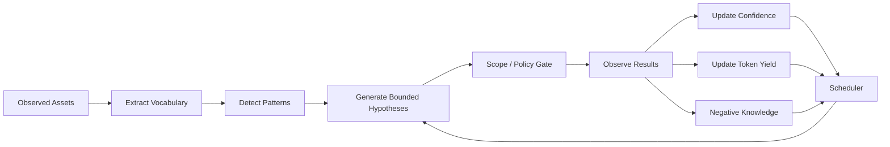
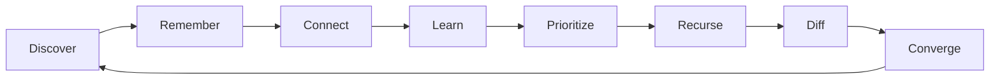

# Night Scout

> **Recursive, scope-aware attack-surface intelligence for authorized bug-bounty reconnaissance.**

Night Scout is a reconnaissance orchestration engine designed to continuously discover, correlate, remember, and prioritize an authorized target's attack surface.

Unlike a traditional linear recon pipeline, Night Scout treats every useful discovery as a new source of intelligence. A hostname may lead to a certificate; a certificate may reveal another hostname; a JavaScript bundle may expose an API path; an archived application may reveal a historical project name; that project name may improve the target-specific vocabulary and generate a new high-confidence hypothesis.

The system is built around five core ideas:

- **recursive discovery**
- **persistent memory**
- **full provenance**
- **strict scope awareness**
- **target-adaptive reconnaissance**

Night Scout is not intended to be an autonomous exploitation framework. Its purpose is to map, enrich, correlate, prioritize, and explain attack-surface discoveries inside an explicitly authorized bug-bounty scope.


---

# Quick Start

Night Scout is distributed for **Debian 13+** and current **Kali Linux**. The
normal end-user path does not require cloning the repository, creating a Python
virtual environment, or managing the PyInstaller bundle manually.

## Installation

### Option A — install a prebuilt GitHub Release

Download the `.deb` matching your architecture from the project's GitHub
**Releases** page, then install the downloaded file from the directory where it
was saved:

```bash
sudo apt install ./nightscout_<version>_amd64.deb
```

For ARM64 builds use the corresponding `arm64` package when it is published.
APT installs the complete standalone runtime and exposes the command globally as
`nightscout`.

Verify the install:

```bash
nightscout --version
```

### Option B — build the `.deb` from source

For development or a local build:

```bash
git clone https://github.com/Breezeexe/Night-scout
cd Night-scout

python3 -m venv .venv
source .venv/bin/activate
python -m pip install --upgrade pip
python -m pip install -e '.[release]'

python scripts/build_deb.py
sudo apt install ./release/nightscout_<version>_amd64.deb
```

`build_deb.py` reuses an existing PyInstaller one-folder bundle when available;
otherwise it builds the standalone distribution first. It also writes a
`.deb.sha256` companion file.

## First Setup

Run setup once as the **normal user who will run reconnaissance**:

```bash
nightscout setup
```

Do not run this command itself with `sudo`. The Debian package owns the immutable
application under `/usr`; setup creates per-user configuration/state, installs
or verifies the required companion tools, synchronizes the conservative default
public wordlists, and runs `doctor`. Tool installation is APT-first for an
explicit allow-list of correct Debian/Kali packages. When APT needs privileges,
setup invokes `sudo apt-get` itself and may ask for your sudo password. On the
first setup, downloads can take several minutes; APT/PDTM/pipx output and the
current tool are shown live.

The default user state is stored under:

```text
~/.config/nightscout/       configuration and scope
~/.local/share/nightscout/  SQLite workspace, tools, wordlists, artifacts
~/.cache/nightscout/        disposable caches
```

Useful setup variants:

```bash
# Initialize without downloading companion tools or public wordlists.
nightscout setup --skip-tools --skip-wordlists

# Also install optional mobile-analysis tools.
nightscout setup --optional-tools

# Refresh already managed companion tools during setup.
nightscout setup --update-tools
```

## First Authorized Run

For a real bug-bounty program, model the program rules in one scope YAML and let
Night Scout derive all domain discovery seeds from it:

```bash
nightscout run --scope ./program.yaml
```

Scope and seeds are different concepts. Exact `IN_SCOPE` DOMAIN rules are
started directly. A wildcard such as `*.example.org` creates a passive discovery
anchor at `example.org` so passive enumeration can start, but the apex itself is
**not** promoted to active scope. Every discovered concrete hostname is
classified again against the real scope rules.

You can also provide several explicit seeds while keeping the YAML as the
authorization boundary:

```bash
nightscout run api.example.com portal.example.net example.org --scope ./program.yaml
```

Any explicit seed that is not `IN_SCOPE` or a valid `PASSIVE_ONLY` discovery
anchor is rejected before the recursive runtime starts.

For a one-domain quick start, the managed local scope can still be used:

```bash
nightscout run example.com
```

The default scope starts **fail-closed**. If `example.com` has no local scope
rule yet, an interactive first run asks for explicit authorization of the exact
domain and separately asks whether wildcard subdomains are authorized. Existing
`OUT_OF_SCOPE`, `PASSIVE_ONLY`, or otherwise explicit classifications are never
silently overridden.

For automation/non-interactive use with the managed local scope:

```bash
# Exact domain only.
nightscout run example.com --authorize-exact

# Exact domain plus *.example.com.
nightscout run example.com --authorize-subdomains
```

A minimal program scope looks like:

```yaml
schema_version: 1
target_id: example-program
display_name: Example Bug Bounty Program
gate:
  allow_unknown_passive: false
rules:
  - rule_id: api-exact
    kind: DOMAIN
    pattern: api.example.com
    state: IN_SCOPE
    priority: 100
    tier: L1
    reason: Explicitly listed by the program

  - rule_id: wildcard-main
    kind: DOMAIN
    pattern: "*.example.org"
    state: IN_SCOPE
    priority: 100
    tier: L2
    reason: Program explicitly authorizes this wildcard

  - rule_id: excluded-admin
    kind: DOMAIN
    pattern: admin.example.org
    state: OUT_OF_SCOPE
    priority: 300
    reason: Explicit program exclusion
```

Copy the program's scope literally: exact assets become exact rules, wildcards
remain wildcards, and exclusions get a higher priority. Do not infer scope from
DNS, certificates, ASN ownership, CNAMEs, or shared infrastructure.

## Everyday Usage

```bash
# Run every domain seed derived from a real program scope.
nightscout run --scope ./program.yaml

# Or provide several explicit seeds under the same authorization boundary.
nightscout run api.example.com portal.example.net --scope ./program.yaml

# One-domain quick start remains available.
nightscout run example.com

# Bound one invocation while keeping the persistent frontier in SQLite.
nightscout run --scope ./program.yaml --max-steps 100

# Inspect persistent runs, tasks, assets and review state.
nightscout status

# Explain a persisted Event by event ID or exact Event value.
nightscout explain <event-id-or-value>

# Export SAFE JSONL, TXT and CSV views.
nightscout export

# Export one format.
nightscout export --format jsonl
nightscout export --format text
nightscout export --format csv

# Sensitive evidence is a separate double-opt-in export surface.
nightscout export --sensitive --confirm-sensitive

# Check configuration, platform and companion tools without scanning.
nightscout doctor
```

### Companion tools

Normally `nightscout setup` handles required tools. Advanced/manual management
remains available:

```bash
nightscout tools list
nightscout tools verify
nightscout tools install
nightscout tools install --optional
nightscout tools install --update
```

### Wordlists

The bundled baseline corpus is available immediately after setup. Public corpora
can be inspected or refreshed explicitly:

```bash
nightscout wordlists list
nightscout wordlists verify
nightscout wordlists sync
nightscout wordlists sync --all
```

Large public corpora are stored in the per-user Night Scout data directory, not
committed into the main repository. The runtime itself never performs an
implicit wordlist download during reconnaissance.

---


# 1. Core Concept

A conventional recon pipeline often looks like:

```text
subdomains
    ↓
resolve
    ↓
HTTP probe
    ↓
scan
    ↓
done
```

Night Scout is intentionally different:

```text
DISCOVERY
    ↓
NORMALIZATION
    ↓
SCOPE / POLICY GATE
    ↓
DEDUPLICATION
    ↓
ENRICHMENT
    ↓
KNOWLEDGE BASE
    ↓
SCORING
    ↓
SCHEDULER
    ↓
NEW TASKS
    ↓
DISCOVERY
```

The system forms a controlled feedback loop.

A discovery can generate new events, and those events can activate other modules:

```text
certificate SAN
    ↓
hostname
    ↓
DNS
    ↓
HTTP service
    ↓
JavaScript
    ↓
API endpoint
    ↓
target vocabulary
    ↓
naming pattern
    ↓
bounded hypothesis
    ↓
new hostname
```

The purpose of recursion is not to create infinite traffic.

The purpose is to let every new piece of target knowledge improve the next reconnaissance decision.

---

# 2. High-Level Architecture



Night Scout is an **orchestration and intelligence layer**.

It should not reimplement mature low-level capabilities such as:

```text
DNS resolution
HTTP probing
TLS parsing
web crawling
archive retrieval
mobile decompilation
```

Instead, external tools are connected through adapters and their results are normalized into Night Scout events.

---

# 3. Repository Structure

```text
night-scout/
├── README.md
├── pyproject.toml
├── .gitignore
│
├── recon/
│   ├── __init__.py
│   ├── cli.py
│   ├── runtime.py
│   ├── userenv.py
│   │
│   ├── core/
│   │   ├── events.py
│   │   ├── queue.py
│   │   ├── router.py
│   │   ├── scheduler.py
│   │   ├── budgets.py
│   │   └── lifecycle.py
│   │
│   ├── policy/
│   │   ├── scope.py
│   │   ├── seeds.py
│   │   ├── rate_limit.py
│   │   ├── restrictions.py
│   │   └── review_gate.py
│   │
│   ├── storage/
│   │   ├── database.py
│   │   ├── models.py
│   │   ├── provenance.py
│   │   ├── snapshots.py
│   │   ├── intelligence.py
│   │   └── schema.py
│   │
│   ├── workers/
│   │   ├── passive_domains.py
│   │   ├── dns.py
│   │   ├── permutations.py
│   │   ├── http.py
│   │   ├── tls.py
│   │   ├── asn.py
│   │   ├── archives.py
│   │   ├── crawler.py
│   │   ├── javascript.py
│   │   ├── vhost.py
│   │   ├── content.py
│   │   ├── parameters.py
│   │   ├── mobile.py
│   │   ├── fingerprints.py
│   │   └── nuclei.py
│   │
│   ├── intelligence/
│   │   ├── wordlists.py
│   │   ├── vocabulary.py
│   │   ├── patterns.py
│   │   ├── confidence.py
│   │   ├── novelty.py
│   │   ├── yield_model.py
│   │   ├── convergence.py
│   │   ├── genome.py
│   │   └── vulnerabilities.py
│   │
│   └── exporters/
│       ├── jsonl.py
│       ├── text.py
│       └── csv.py
│
├── configs/
│   ├── scope.example.yaml
│   ├── pipeline.example.yaml
│   └── nuclei-templates.example.yaml
│
├── migrations/
│   ├── env.py
│   ├── script.py.mako
│   └── versions/
│       └── 0001_initial_schema_*.py
├── tests/
│   ├── test_migrations.py
│   ├── test_runtime.py
│   ├── test_scope_and_policy.py
│   ├── test_storage_regressions.py
│   ├── test_wordlists_sync.py
│   └── ...
│
├── wordlists/
│   ├── manifest.yaml
│   ├── sources.yaml
│   ├── builtins/
│   ├── cache/          # gitignored external corpora
│   └── generated/      # gitignored lock/local manifest
│
├── docs/
└── scripts/
    ├── wordlists_sync.py
    ├── install_tools.py
    ├── tools_manifest.yaml
    ├── build_binary.py
    ├── build_deb.py
    └── verify_release.py
```

---

# 4. File and Module Responsibilities

## `recon/cli.py`

Thin Typer command-line entry point. The initial runtime exposes:

```text
nightscout setup
nightscout run <root-domain>
nightscout status
nightscout explain <event-id-or-value>
nightscout export
nightscout doctor
nightscout tools ...
nightscout wordlists ...
```

The CLI contains no recon logic itself; it loads configuration and delegates
to `recon/runtime.py`.

---

## `recon/runtime.py`

Composition root for the executable Night Scout application. It wires:

```text
YAML configs -> SQLite -> EventBus -> Router -> Scheduler
             -> scope/restrictions/review/budgets
             -> worker registry -> new Events -> recursive frontier
```

It also connects provenance, snapshots, vocabulary projection, cached NVD CVE
enrichment, yield/convergence instrumentation, Target Genome persistence, and
SAFE/SENSITIVE exporters. Runtime decisions never override policy gates.

---

## `recon/core/events.py`

Defines the internal event contract.

Everything Night Scout discovers is represented as an event.

Examples:

```text
DNS_NAME
IP_ADDRESS
URL
HTTP_SERVICE
CERTIFICATE
JAVASCRIPT
API_ENDPOINT
ARTIFACT
VOCAB_TOKEN
NAMING_PATTERN
```

This file is one of the central architectural components because all workers communicate through the event model.

---

## `recon/core/queue.py`

Persistent task queue.

Responsibilities:

```text
enqueue tasks
deduplicate pending work
persist unfinished tasks
resume after interruption
track task state
```

The queue should be restart-safe.

---

## `recon/core/router.py`

Determines what can happen next after a new event appears.

Example:

```text
DNS_NAME
    ↓
DNS worker
TLS worker
HTTP worker
archive worker
```

or:

```text
JAVASCRIPT
    ↓
JS extraction
vocabulary extraction
endpoint extraction
hostname extraction
```

The router does not decide whether a task is authorized.

That belongs to the policy layer.

---

## `recon/core/scheduler.py`

Selects which eligible task should run next.

The scheduler considers:

```text
scope state
confidence
novelty
expected yield
worker cost
branch budget
previous failures
target-specific knowledge
```

Its goal is to spend recon effort where the expected information gain is highest.

---

## `recon/core/budgets.py`

Controls bounded recursion.

Budget types may include:

```text
requests per host
worker executions
candidate count
branch depth
time
concurrent hosts
historical retries
```

Budgets prevent combinatorial explosion.

---

## `recon/core/lifecycle.py`

Coordinates the lifecycle of:

```text
run
round
branch
task
worker execution
shutdown
resume
```

It also defines convergence behavior.

---

# 5. Policy Layer

The policy layer is a mandatory boundary between intelligence and active reconnaissance.

```text
RELATIONSHIP
      ↓
SCOPE CHECK
      ↓
POLICY CHECK
      ↓
RATE LIMIT
      ↓
BUDGET CHECK
      ↓
WORKER
```

A discovered relationship does **not** automatically imply authorization.

For example:

```text
in-scope hostname
    ↓
IP
    ↓
ASN
    ↓
neighboring infrastructure
```

The neighboring infrastructure may be useful intelligence but must remain passive unless the selected bug-bounty scope explicitly authorizes it.

---

## `recon/policy/scope.py`

Determines whether an asset is:

```text
IN_SCOPE
OUT_OF_SCOPE
PASSIVE_ONLY
AMBIGUOUS
```

The scope engine should understand:

```text
exact domains
wildcard domains
URLs
mobile applications
CIDRs where explicitly authorized
excluded assets
program-specific scope tiers
```

No active worker should receive an event before a scope decision exists.

---

## `recon/policy/seeds.py`

Keeps the authorization boundary separate from discovery start points. It
derives many domain seeds from a program scope and creates non-persistent
`PASSIVE_ONLY` apex anchors for leading wildcard rules such as
`*.example.com`. Those anchors exist only so passive discovery can start; they
never convert the apex into active scope.

---

## `recon/policy/rate_limit.py`

Global rate-control layer.

Rate limiting must be centralized rather than implemented independently inside workers.

Possible dimensions:

```text
requests per host
requests per IP
global concurrency
worker-specific concurrency
program-specific limits
```

---

## `recon/policy/restrictions.py`

Represents program-specific rules.

Examples:

```text
active VHOST allowed / forbidden
content discovery allowed / restricted
authentication testing forbidden
high-volume automation forbidden
specific asset classes passive-only
```

---

## `recon/policy/review_gate.py`

Stops automation when an event should be manually reviewed.

Examples:

```text
POSSIBLE_SECRET
POSSIBLE_PRIVATE_DATA
AUTH_BOUNDARY
POLICY_AMBIGUITY
OUT_OF_SCOPE_REFERENCE
POSSIBLE_HIGH_IMPACT_SURFACE
```

The expected behavior is:

```text
interesting discovery
    ↓
review required
    ↓
automation stops for that branch
```

not:

```text
interesting discovery
    ↓
automatic escalation
```

---

# 6. Event Model

A normalized event may look like:

```json
{
  "event_id": "evt_01...",
  "type": "URL",
  "value": "https://api.example.com/v2/orders",
  "source": "crawler",
  "parent_event_id": "evt_00...",
  "first_seen": "2026-08-18T18:00:00Z",
  "last_seen": "2026-08-18T18:00:00Z",
  "scope_state": "IN_SCOPE",
  "confidence": 0.96,
  "novelty": 0.71,
  "depth": 3,
  "metadata": {
    "http_status": 401,
    "content_length": 83,
    "content_type": "application/json"
  }
}
```

Core event types:

```text
ROOT_DOMAIN
DNS_NAME
DNS_RECORD
IP_ADDRESS
ASN
CIDR

URL
URL_PATH
HTTP_SERVICE
HTTP_RESPONSE

CERTIFICATE
CERT_SAN

FAVICON
TECHNOLOGY
FINGERPRINT

JAVASCRIPT
API_ENDPOINT
PARAMETER_NAME

ARTIFACT
MOBILE_ARTIFACT

PROJECT_NAME
VOCAB_TOKEN
NAMING_PATTERN

RELATIONSHIP

POLICY_BLOCK
HUMAN_REVIEW
```

---

# 7. Provenance

Every event must retain its discovery path.

Night Scout should always be able to answer:

```text
Where did this asset come from?
Why do we believe it exists?
Which previous event caused its discovery?
Which worker generated it?
What evidence supports it?
```

Example chain:

```text
historical APK
    ↓
string
    ↓
project name
    ↓
target vocabulary
    ↓
naming pattern
    ↓
candidate hostname
    ↓
DNS resolution
    ↓
certificate
    ↓
HTTP service
    ↓
JavaScript
    ↓
API endpoint
```

Conceptually:

```text
parent_event_id
source_worker
source_artifact
timestamp
evidence
scope_decision
```

This makes discoveries explainable and reproducible.

---

# 8. Knowledge Graph

Night Scout's data is naturally graph-shaped.

Example:

```text
DOMAIN
  │ resolves_to
  ▼
IP
  │ presents
  ▼
CERTIFICATE
  │ contains_SAN
  ▼
DOMAIN
```

Another example:

```text
APK
  │ contains
  ▼
HOSTNAME
  │ serves
  ▼
JAVASCRIPT
  │ references
  ▼
API_ENDPOINT
```

Relationships can initially be stored in SQLite:

```text
relationships(
    source_event_id,
    relation_type,
    target_event_id
)
```

A dedicated graph database is not required for the first architecture.

The event model should make it possible to add one later without redesigning the system.

---

# 9. Target Genome

The **Target Genome** is Night Scout's adaptive knowledge layer.

It is not initially a neural-network model.

It is an explainable collection of target-specific observations, statistics, patterns, and successful hypotheses.

The genome may contain:

```text
naming conventions
environment names
region codes
service names
internal vocabulary
project names
application titles
technology combinations
URL structures
historical prefixes
historical suffixes
certificate relationships
API version patterns
artifact-derived terminology
```

Example observations:

```text
warehouse-api-prod-msk-01
warehouse-api-stage-msk-01
delivery-api-prod-spb-02
```

Possible inferred structure:

```text
{service}-api-{env}-{region}-{number}
```

Known values:

```text
service = warehouse | delivery
env     = prod | stage
region  = msk | spb
number  = 01 | 02
```

Night Scout can then generate a **bounded hypothesis set** rather than blindly combining enormous generic wordlists.

---

# 10. Adaptive Learning Loop



Night Scout learns through:

```text
confirmed hypotheses
failed hypotheses
source yield
worker yield
token performance
pattern performance
historical recurrence
independent evidence
```

The objective is:

```text
more knowledge
    ↓
better hypotheses
    ↓
higher precision
    ↓
less wasted traffic
```

not:

```text
more knowledge
    ↓
more requests
```

---

# 11. Vocabulary Engine

Generic wordlists are useful seeds, but the target itself should eventually become the primary vocabulary source.

Public corpora are synchronized explicitly with `scripts/wordlists_sync.py`; the recursive runtime never downloads them. Large SecLists/Assetnote/Trickest data lives under the gitignored `wordlists/cache/`, while `sources.lock.yaml` records the exact raw and normalized SHA-256 values used locally. The bundled `wordlists/manifest.yaml` remains a small always-available bootstrap corpus; synchronized sources are exposed through `wordlists/generated/manifest.local.yaml`.

Vocabulary can be extracted from:

```text
hostname labels
URL paths
parameter names
JavaScript identifiers
API names
page titles
certificate SANs
archived pages
archive filenames
mobile artifacts
project names
public documentation
technology identifiers
```

Example:

```text
warehouse-api-preprod-msk-02.example.com
```

becomes:

```text
warehouse
api
preprod
msk
02
```

Each token can maintain:

```text
frequency
source diversity
first_seen
last_seen
context
hostname position
path position
successful hypotheses
failed hypotheses
yield score
```

This creates a target-specific language model without requiring opaque machine learning.

---

# 12. Pattern Engine

The pattern engine converts observations into candidate structures.

Example:

```text
api-prod-msk-01
api-stage-msk-01
api-prod-spb-01
```

Possible pattern:

```text
api-{env}-{region}-{number}
```

Pattern confidence should increase when:

```text
multiple independent examples match
new generated candidates are confirmed
the same structure appears historically
different sources support the pattern
```

Pattern confidence should decrease when:

```text
generated candidates consistently fail
the pattern only fits one example
evidence is derived from a single noisy source
```

The pattern engine must favor precision over volume.

---

# 13. Negative Knowledge

Failed hypotheses are valuable data.

Example:

```text
candidate:
api-preprod-spb-03.example.com

result:
NXDOMAIN

checked_at:
2026-08-18
```

Without negative knowledge, recursive systems repeatedly regenerate the same dead candidates.

Negative observations should have a TTL because infrastructure can change.

Example:

```text
recent NXDOMAIN
    ↓
suppress candidate

old NXDOMAIN
    ↓
eligible for future recheck
```

---

# 14. Confidence Model

A hypothesis and a directly observed asset must not be treated equally.

Example:

```text
api-preprod.example.com

evidence:
  old JavaScript reference

confidence:
  LOW
```

Later:

```text
api-preprod.example.com

evidence:
  old JavaScript reference
  DNS resolution
  TLS certificate
  HTTP response

confidence:
  HIGH
```

Confidence should consider:

```text
source quality
independent evidence count
direct observation
repeatability
historical recurrence
contradictions
```

Multiple tools using the same underlying data source should not count as fully independent evidence.

---

# 15. Novelty Model

Novelty measures how unusual or previously unseen an asset is.

Possible positive signals:

```text
first seen in current snapshot
absent from common passive sources
historical-only origin
unusual naming pattern
unique favicon
unique title
new certificate relationship
new API surface
old / stage / preprod indication
newly changed service
```

Possible negative signals:

```text
duplicate content
generic CDN asset
static-only surface
known marketing application
very common fingerprint
```

Novelty does not represent vulnerability severity.

It controls recon priority.

---

# 16. Yield Model

Night Scout tracks how productive sources and workers are for the current target.

Example:

```text
source                 candidates   confirmed   yield
CT                         1200         410      34%
generic permutations      45000          12     0.03%
target patterns             380          94      25%
historical JS               140          51      36%
```

This allows the scheduler to gradually prefer target-specific, high-yield methods.

Yield can be tracked for:

```text
workers
sources
tokens
patterns
artifact types
historical sources
fingerprints
```

---

# 17. Scheduler

The scheduler decides which task is most valuable to run next.

Conceptually:

```text
priority =
    confidence
  × novelty
  × expected_yield
  × policy_multiplier
  ÷ estimated_cost
```

Possible task inputs:

```text
scope certainty
confidence
novelty
expected information gain
worker cost
branch depth
previous failures
historical uniqueness
change recency
```

A policy denial always overrides priority.

```text
OUT_OF_SCOPE
    ↓
no active task
```

---

# 18. Cost Model

Every worker should have an approximate cost.

Example conceptual scale:

```text
local parsing              0
passive lookup             0
DNS                        1
HTTP metadata              2
TLS                        2
archive lookup             2
crawl                      5
targeted content          15
VHOST                     20
broad active discovery    30
```

The exact values are implementation details.

The important architectural idea is that expensive recursive branches require stronger justification.

---

# 19. Convergence

Night Scout must eventually stop exploring an unproductive branch.

A branch tracks:

```text
new domains
new live hosts
new URLs
new API endpoints
new vocabulary
new patterns
new relationships
```

If the marginal discovery rate approaches zero:

```text
branch
    ↓
converged
    ↓
closed
```

If a new discovery suddenly creates a productive cluster:

```text
branch
    ↓
new evidence
    ↓
budget extension
```

This creates **controlled recursion**, not an infinite loop.

---

# 20. Worker Model

Workers are adapters around external tools or local processors.

```text
EVENT
  ↓
WORKER ADAPTER
  ↓
EXTERNAL TOOL / LOCAL PROCESSOR
  ↓
PARSER
  ↓
NORMALIZED EVENTS
```

Conceptual interface:

```python
class Worker:
    accepts: set[str]
    emits: set[str]
    active: bool
    estimated_cost: int

    def eligible(self, event, context) -> bool:
        ...

    def run(self, event, context):
        ...
```

The event contract is stable.

Specific tools are replaceable.

---

# 21. Worker Classes

## Passive Domain Discovery

Purpose:

```text
find hostnames
collect certificate names
collect public relationships
generate passive DNS evidence
```

Outputs:

```text
DNS_NAME
CERTIFICATE
CERT_SAN
RELATIONSHIP
```

---

## DNS

Purpose:

```text
resolve candidates
collect DNS records
identify wildcard behavior
record negative observations
```

Outputs may include:

```text
DNS_RECORD
IP_ADDRESS
RELATIONSHIP
```

---

## Permutations

Two main modes:

```text
generic mutation
target-pattern mutation
```

Target-pattern generation should receive more weight as the Target Genome becomes richer.

---

## HTTP

Purpose:

```text
determine service presence
capture response metadata
fingerprint content
detect changes
```

Useful metadata:

```text
status
length
title
content type
redirect
server hints
body hash
header hash
```

Compact human export:

```text
[200] [8321] [Portal] https://portal.example.com/
[401] [83]   [API]    https://api.example.com/
[403] [0]             https://admin-stage.example.com/
```

---

## TLS

Purpose:

```text
certificate collection
SAN extraction
certificate relationships
TLS metadata
```

Typical pivot:

```text
hostname
    ↓
certificate
    ↓
SAN
    ↓
candidate hostname
    ↓
scope gate
```

---

## ASN / IP Context

Purpose:

```text
map known infrastructure relationships
associate known IPs with network context
identify passive neighboring evidence
```

ASN ownership is **not** automatic authorization.

---

## Archives

Purpose:

```text
recover historical URLs
recover removed paths
recover historical hostnames
recover project names
recover old application references
```

Historical evidence feeds:

```text
vocabulary
patterns
artifact analysis
URL intelligence
```

---

## Crawler

Purpose:

```text
links
paths
JavaScript
API references
host references
application structure
```

Crawler discoveries return to the central event bus.

---

## JavaScript

JavaScript is a first-class intelligence source.

Possible outputs:

```text
API paths
hostnames
parameter names
project vocabulary
configuration names
additional scripts
application fingerprints
```

---

## VHOST

VHOST discovery is a policy-gated active worker.

Requirements:

```text
explicit authorization
scope approval
central rate limiting
candidate hostnames
bounded request budget
```

It should never turn passive ASN relationships into uncontrolled active scanning.

---

## Content

Purpose:

```text
targeted file/path discovery
historical file recovery
old application surface discovery
```

Content discovery should prefer:

```text
target vocabulary
historical paths
artifact-derived paths
application-specific candidates
```

over uncontrolled generic enumeration.

---

## Parameters

Purpose:

```text
candidate parameter discovery
parameter-name intelligence
application surface enrichment
```

Behavioral vulnerability testing should remain separate from reconnaissance.

---

## Mobile / Artifacts

Offline artifact analysis may inspect:

```text
APK
AAB
DEX
AAR
ZIP
application resources
historical builds
```

Possible outputs:

```text
hostname
URL
API base path
project name
configuration name
candidate secret
```

Potential secrets are routed to human review rather than automatically used.

---

## Fingerprints

Possible fingerprints:

```text
favicon
page title
headers
body hash
TLS properties
technology combination
unique application strings
```

Fingerprints are useful relationship generators.

Any newly related asset still returns through the scope gate before active interaction.

---

# 22. Storage Model

Night Scout uses three storage layers with different purposes:

```text
SQLite
    ↓
persistent system state

JSONL
    ↓
append-friendly event trail

TXT / CSV
    ↓
human-readable exports
```

SQLite remains the source of truth.

---

# 23. Suggested SQLite Entities

Logical tables:

```text
events
assets
relationships
evidence
tasks
worker_runs
scope_decisions
tokens
patterns
negative_observations
snapshots
changes
review_queue
budgets
```

Example relationship:

```text
source_event_id
relation_type
target_event_id
```

Example evidence row:

```text
event_id
source
source_type
observed_at
confidence_delta
metadata
```

---

# 24. Snapshot Model

Night Scout keeps historical state.

Conceptually:

```text
snapshot 001
snapshot 002
snapshot 003
...
```

The system compares snapshots and emits change events such as:

```text
NEW_HOST
NEW_URL
NEW_ENDPOINT
NEW_CERT_SAN
IP_CHANGED
STATUS_CHANGED
TITLE_CHANGED
BODY_HASH_CHANGED
NEW_JAVASCRIPT
RESURRECTED_HOST
DISAPPEARED_HOST
SCOPE_CHANGED
```

The attack surface is treated as a changing system rather than a static scan target.

---

# 25. Differential Recon

Historical comparison is part of discovery itself.

Example:

```text
yesterday:
admin-stage.example.com -> 403

today:
admin-stage.example.com -> 200
```

Night Scout records:

```text
STATUS_CHANGED
403 -> 200
```

Another example:

```text
new certificate
    ↓
new SAN
    ↓
new hostname
    ↓
new branch
```

A newly changed asset may receive a higher priority than a long-known static host.

---

# 26. Human Review Queue

Sensitive findings should be visible without being automatically acted upon.

Example:

```text
[REVIEW]
type: POSSIBLE_SECRET
source: historical mobile artifact
event: evt_...
automation: paused
```

Possible review classes:

```text
POSSIBLE_SECRET
POSSIBLE_PRIVATE_DATA
AUTH_REQUIRED
OUT_OF_SCOPE_REFERENCE
POLICY_AMBIGUITY
UNUSUAL_ADMIN_SURFACE
POSSIBLE_HIGH_IMPACT_SURFACE
```

---

# 27. Target Workspace

Real target data must be isolated from the engine code.

Conceptual layout:

```text
workspace/
└── target-id/
    ├── scope.yaml
    ├── policy.yaml
    ├── recon.db
    ├── events.jsonl
    │
    ├── artifacts/
    ├── snapshots/
    ├── exports/
    ├── logs/
    └── notes/
```

The repository contains the engine.

The workspace contains target knowledge.

```text
ENGINE
    ≠
TARGET DATA
```

---

# 28. Example Scope Model

```yaml
target_id: example-program

allowed:
  domains:
    - example.com
    - "*.example.com"

passive_only:
  related_domains: true
  certificate_neighbors: true
  asn_neighbors: true

active:
  enabled: true

limits:
  requests_per_second_per_host: 5
  max_concurrent_hosts: 10

stop_conditions:
  private_data: true
  possible_secret: true
  auth_boundary: true
```

The schema is intentionally target-agnostic.

Different bug-bounty programs can be represented without changing the engine architecture.

---

# 29. Event Flow Example

```text
ROOT_DOMAIN
    ↓
PASSIVE DOMAIN WORKER
    ↓
DNS_NAME
    ↓
SCOPE GATE
    ↓
DNS WORKER
    ↓
IP_ADDRESS
    ↓
HTTP + TLS
    ↓
HTTP_SERVICE + CERTIFICATE
    ↓
CRAWLER
    ↓
JAVASCRIPT
    ↓
API_ENDPOINT + VOCAB_TOKEN
    ↓
TARGET GENOME
    ↓
NAMING_PATTERN
    ↓
BOUNDED CANDIDATE
    ↓
SCOPE GATE
    ↓
DNS WORKER
```

This is the fundamental recursive mechanism of Night Scout.

---

# 30. Historical Artifact Flow Example

```text
ARCHIVE
    ↓
OLD APPLICATION PACKAGE
    ↓
OFFLINE PARSER
    ↓
PROJECT NAME
    ↓
VOCABULARY ENGINE
    ↓
TARGET-SPECIFIC TOKEN
    ↓
PATTERN ENGINE
    ↓
HOSTNAME HYPOTHESIS
    ↓
SCOPE GATE
    ↓
OBSERVATION
```

---

# 31. Fingerprint Pivot Example

```text
KNOWN APPLICATION
    ↓
FAVICON / TITLE / BODY HASH
    ↓
FINGERPRINT EVENT
    ↓
PASSIVE RELATIONSHIPS
    ↓
CANDIDATE ASSET
    ↓
SCOPE CHECK
```

Fingerprint similarity is evidence of relationship.

It is not evidence of authorization.

---

# 32. Core Loop Pseudocode

```python
while scheduler.has_tasks():
    task = scheduler.next()

    if not policy.scope_allows(task):
        storage.record_block(task, reason="scope")
        continue

    if not budgets.allow(task):
        scheduler.defer(task)
        continue

    if policy.requires_human_review(task):
        review_queue.add(task)
        continue

    raw_result = workers[task.worker].run(task)

    for event in normalize(raw_result):
        event = storage.upsert(event)

        provenance.link(task, event)

        confidence.update(event)
        novelty.update(event)
        genome.learn(event)

        if policy.event_requires_review(event):
            review_queue.add(event)
            continue

        for next_task in router.expand(event):
            if feedback.accept(next_task):
                scheduler.enqueue(next_task)

    convergence.update(task.branch)
```

Critical ordering:

```text
scope
    ↓
policy
    ↓
budget
    ↓
review
    ↓
worker
```

Never:

```text
worker
    ↓
check authorization later
```

---

# 33. Feedback Quality Control

Not every extracted string should create another recon branch.

Weak signal:

```text
production
```

Strong signal:

```text
fulfillment-api-stage-msk-02.example.com
```

Feedback scoring may consider:

```text
source quality
context
frequency
structure
entropy
position
historical reuse
independent confirmations
target relevance
```

Only sufficiently useful signals should produce new tasks.

This is essential for controlling recursive growth.

---

# 34. Explainability

Every scheduled action should be explainable.

For any asset, Night Scout should eventually be able to show:

```text
asset
scope state
confidence
novelty
first seen
last seen

discovery path
evidence
related assets
workers executed
negative observations
patterns involved
changes over time
```

Conceptually:

```text
nightscout explain api-stage.example.com
```

Example output:

```text
api-stage.example.com

scope:
  IN_SCOPE

first discovered:
  historical JavaScript

discovery path:
  archive
  -> old app.js
  -> hostname string
  -> DNS resolution
  -> TLS certificate
  -> HTTP service

confidence:
  0.97

novelty:
  0.88

related:
  certificate cert_...
  IP 203.0.113.15
  api-prod.example.com

changes:
  2026-08-18 NEW_HOST
```

Explainability is a core requirement, not an optional UI feature.

---

# 35. Fundamental Invariants

These rules define the architecture.

## Invariant 1

```text
No active request without a scope decision.
```

## Invariant 2

```text
Every finding has provenance.
```

## Invariant 3

```text
A relationship does not equal authorization.
```

## Invariant 4

```text
Every expensive recursive branch has a budget.
```

## Invariant 5

```text
Negative observations are remembered.
```

## Invariant 6

```text
Target knowledge remains isolated from engine code.
```

## Invariant 7

```text
Sensitive evidence pauses automation.
```

## Invariant 8

```text
Every scheduled task must be explainable.
```

## Invariant 9

```text
Recursive exploration must converge.
```

## Invariant 10

```text
Adaptation should improve precision, not simply increase traffic.
```

---

# 36. Night Scout in One Diagram



Operationally:

```text
discover
    ↓
remember
    ↓
connect
    ↓
learn
    ↓
prioritize
    ↓
recurse
    ↓
diff
    ↓
converge
```

---

# 37. Project Identity

**Night Scout** is not a wrapper around a collection of scanners.

It is the intelligence layer between reconnaissance tools and the researcher.

Its job is to transform isolated observations into a persistent model of an authorized target:

```text
raw signals
    ↓
events
    ↓
relationships
    ↓
target knowledge
    ↓
better hypotheses
    ↓
higher-value reconnaissance
```

The central idea is simple:

> **The next reconnaissance step should be informed by everything already learned about the target.**

Night Scout therefore treats reconnaissance as a continuously improving model of the attack surface rather than a one-time scan.


---

# 38. Database Migrations and Regression Tests

Night Scout uses Alembic for persistent workspace schema upgrades. Runtime
startup upgrades the configured SQLite workspace to the current migration head
**before** opening the async SQLAlchemy engine.

```text
empty DB
   ↓
Alembic upgrade head
   ↓
current schema
```

Legacy Night Scout workspaces created before Alembic are adopted conservatively:

```text
unversioned DB
   ↓
exact table/column compatibility check
   ├─ match    → stamp baseline revision, preserve data
   └─ mismatch → fail closed; do not rewrite the DB
```

Development migration checks:

```bash
alembic -c alembic.ini upgrade head
alembic -c alembic.ini check
```

The test suite is the release regression gate:

```bash
pytest
coverage run -m pytest
coverage report
```

It deliberately covers the highest-risk architectural boundaries rather than
requiring real target traffic or installed recon CLIs: scope precedence,
restriction fail-closed behavior, secret redaction/sensitive export, confidence
independence, novelty, yield attribution, NVD privacy/cache behavior, Nuclei
template auditing, SQLite FK ordering, migrations, CLI, and a local recursive
runtime smoke using the permutations worker.

External binaries are tested through adapters/fake subprocess fixtures. Normal
unit/integration tests must not contact reconnaissance targets.

## Distribution direction

Night Scout remains a Python 3.12+ codebase internally. The release form is a
PyInstaller **one-folder** standalone distribution for Debian/Kali. Specialist
CLIs remain external dependencies managed by `nightscout tools` and checked by
`nightscout doctor`; there is no plan to rewrite the orchestrator in Go/Rust
merely to obtain one binary.

---

# 39. Debian/Kali Tool Supply Chain and Standalone Release

Night Scout intentionally supports only **Debian GNU/Linux** and **Kali Linux**
on `x86_64` and `aarch64`. Runtime startup fails closed on other operating
systems/architectures. The official prebuilt `.deb` is built on Debian 13;
therefore the hosted standalone package targets Debian 13+ and current Kali.
Local `.deb` builds record the build host glibc major/minor as an explicit
`libc6` dependency so APT refuses an ABI-incompatible older system.

Specialist tools are managed separately from the Python orchestrator:

```text
~/.local/share/nightscout/tools/
├── bin/
├── apps/
├── downloads/
└── tools.lock.yaml
```

The managed `bin/` directory is prepended to worker PATH automatically.

Commands:

```bash
nightscout tools list
nightscout tools install
nightscout tools install --optional --install-prerequisites
nightscout tools verify
nightscout wordlists list
nightscout wordlists sync
nightscout wordlists verify
nightscout doctor
```

The tool manifest is `scripts/tools_manifest.yaml`. Tool installation is
**APT-first** for explicitly allow-listed Debian/Kali packages, followed by a
binary identity/version probe. If no compatible distro package is available,
Night Scout falls back to PDTM, pipx, or an official GitHub release as defined
by the manifest. Package names are never guessed: on Kali, ProjectDiscovery
HTTPX is the `httpx-toolkit` package/binary, avoiding the unrelated Python
`httpx` command. PDTM is installed on demand only when a fallback actually needs
it. GitHub binary downloads require an upstream SHA-256 digest/checksum unless
the operator explicitly opts into `--allow-unverified` after manual
verification.

The standalone build remains Python internally but is shipped as a
**PyInstaller one-folder distribution**, not a one-file executable. Specialist
recon binaries are not embedded in Night Scout.

## Package layout and release CI

For end-user installation and day-to-day commands, see **Quick Start** at the
top of this README. The details below describe how that simple interface is
packaged.

The `.deb` installs the complete PyInstaller one-folder runtime under
`/usr/lib/nightscout/` and exposes `/usr/bin/nightscout`. Mutable state is never
stored under `/usr`; `nightscout setup` creates XDG user state under
`~/.config/nightscout/`, `~/.local/share/nightscout/`, and
`~/.cache/nightscout/`.

Local package construction uses the same release path as CI:

```bash
python -m pip install -e '.[release]'
python scripts/build_deb.py
```

`build_deb.py` reuses `release/dist/nightscout` when it already exists;
otherwise it invokes `build_binary.py` first. It emits the Debian package and a
`.deb.sha256` companion file. Low-level standalone verification remains
available for release debugging:

```bash
python scripts/build_binary.py
python scripts/verify_release.py release/dist/nightscout
```

Release CI is defined in `.github/workflows/release.yml`. The GitHub runner
enters a `debian:13-slim` job container, runs the regression/schema gates, builds
the standalone bundle, packages it as `.deb`, installs that package for a smoke
test, and uploads `.deb`, `.deb.sha256`, tarball and tarball SHA-256 artifacts.
On a pushed version tag (`v*`) the same verified files are attached to the
GitHub Release. The current hosted job produces native `amd64`; `arm64` uses the
same scripts on a native Debian/Kali ARM64 build host.
