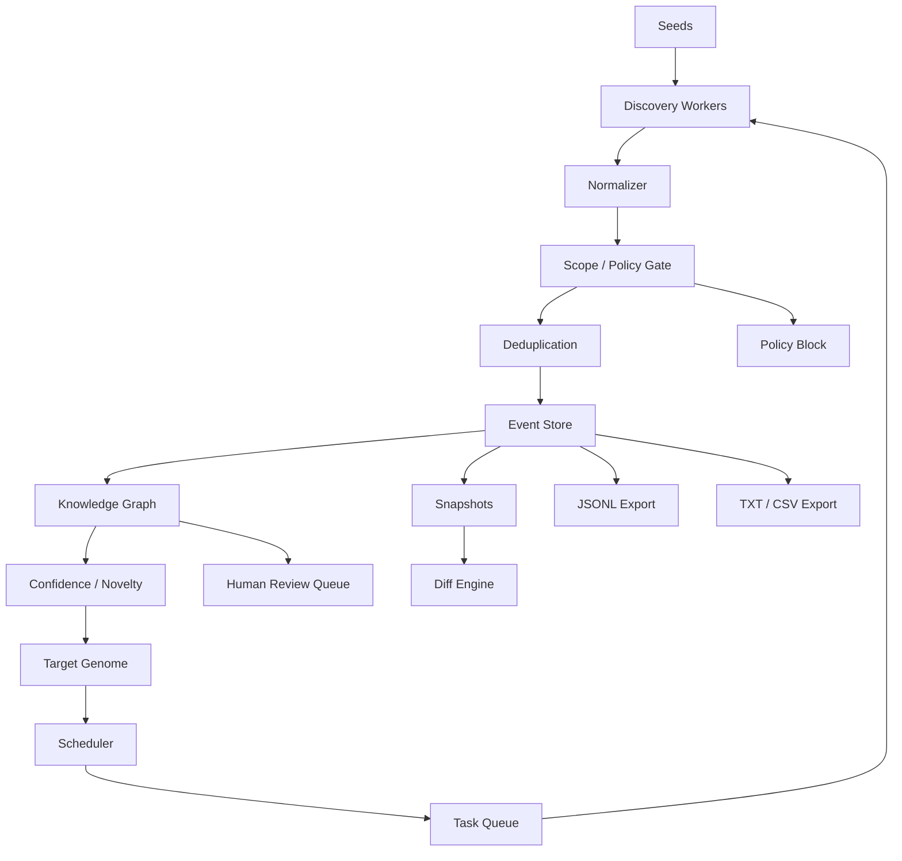
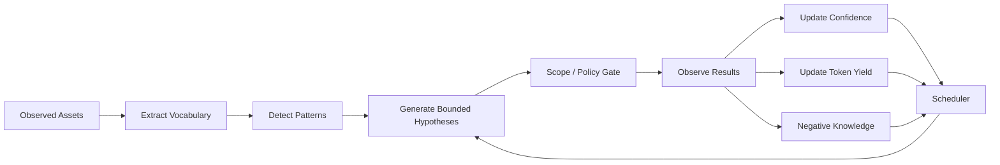
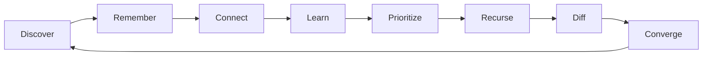

# Night Scout

> **Рекурсивная, scope-aware система анализа поверхности атаки для авторизованной bug-bounty разведки.**

Night Scout — это движок оркестрации разведки, предназначенный для непрерывного обнаружения, корреляции, запоминания и приоритизации поверхности атаки авторизованной цели.

В отличие от традиционного линейного recon pipeline, Night Scout рассматривает каждую полезную находку как новый источник разведданных. Hostname может привести к certificate; certificate может раскрыть другой hostname; JavaScript bundle может показать API path; архивная версия приложения может раскрыть историческое название проекта; это название проекта может улучшить target-specific vocabulary и породить новую гипотезу с высокой уверенностью.

Система строится вокруг пяти основных идей:

- **рекурсивное обнаружение**
- **постоянная память**
- **полный provenance**
- **строгая осведомлённость о scope**
- **адаптация разведки под конкретную цель**

Night Scout не предназначен для автономной эксплуатации уязвимостей. Его задача — картографировать, обогащать, связывать, приоритизировать и объяснять находки поверхности атаки внутри явно разрешённого bug-bounty scope.


---

# Быстрый старт

Night Scout распространяется для **Debian 13+** и актуального **Kali Linux**.
Обычному пользователю не нужно клонировать репозиторий, создавать Python venv
или вручную управлять PyInstaller bundle.

## Установка

### Вариант A — готовый пакет из GitHub Release

Скачайте `.deb` для своей архитектуры со страницы **Releases** проекта и
установите файл из каталога, куда он был сохранён:

```bash
sudo apt install ./nightscout_<version>_amd64.deb
```

Для ARM64 используется соответствующий пакет `arm64`, когда он опубликован. APT
установит полный standalone runtime и создаст глобальную команду `nightscout`.

Проверка установки:

```bash
nightscout --version
```

### Вариант B — собрать `.deb` из исходников

Для разработки или локальной сборки:

```bash
git clone https://github.com/Breezeexe/Night-scout
cd Night-scout

python3 -m venv .venv
source .venv/bin/activate
python -m pip install --upgrade pip
python -m pip install -e '.[release]'

python scripts/build_deb.py
sudo apt install ./release/nightscout_<version>_amd64.deb
```

`build_deb.py` использует существующий PyInstaller one-folder bundle, если он
уже собран; иначе сначала собирает standalone distribution. Рядом создаётся
файл `.deb.sha256`.

## Первый setup

Один раз запустите setup от имени **обычного пользователя, от которого будет
работать reconnaissance**:

```bash
nightscout setup
```

Не запускайте саму команду через `sudo`. Debian-пакет уже установил неизменяемое
приложение в `/usr`; setup создаёт пользовательские конфиги/state,
устанавливает или проверяет обязательные companion tools, синхронизирует
консервативный default-набор публичных словарей и запускает `doctor`. Для явно
разрешённых корректных Debian/Kali пакетов используется APT-first; если APT
нужны права, setup сам вызовет `sudo apt-get` и при необходимости попросит ваш
sudo-пароль. При первом setup загрузка может занять несколько минут, но вывод
APT/PDTM/pipx и текущий tool показываются live.

Пользовательские данные по умолчанию находятся здесь:

```text
~/.config/nightscout/       конфигурация и scope
~/.local/share/nightscout/  target workspaces, tools, wordlists, artifacts
~/.cache/nightscout/        disposable caches
```

Полезные варианты setup:

```bash
# Инициализация без скачивания companion tools и публичных словарей.
nightscout setup --skip-tools --skip-wordlists

# Также установить optional mobile-analysis tools.
nightscout setup --optional-tools

# Обновить уже управляемые companion tools во время setup.
nightscout setup --update-tools
```

## Первый авторизованный запуск

Для реальной bug-bounty программы лучше один раз перенести правила программы в
scope YAML и позволить Night Scout самому получить все domain seeds:

```bash
nightscout run --scope ./program.yaml
```

Поле `target_id` в scope — это стабильный идентификатор программы. Night Scout
выбирает для него отдельный workspace в
`~/.local/share/nightscout/workspaces/<target-id>/` и привязывает SQLite-базу к
этому идентификатору до чтения persistent frontier или записи Events. Несколько
разрешённых доменов в одном scope используют общий workspace; другой `target_id`
выбирает другой workspace.

Scope и seeds — разные вещи. Exact `IN_SCOPE` DOMAIN rule запускается напрямую.
Wildcard вроде `*.example.org` создаёт passive discovery anchor `example.org`,
чтобы Subfinder/архивы могли начать поиск, но сам apex **не становится**
разрешённым для active probing. Каждый найденный конкретный hostname заново
проверяется по настоящим scope rules.

Можно явно задать сразу несколько стартовых доменов, сохранив YAML верхней
границей полномочий:

```bash
nightscout run api.example.com portal.example.net example.org --scope ./program.yaml
```

Если explicit seed не является `IN_SCOPE` или допустимым `PASSIVE_ONLY`
discovery anchor, Night Scout остановится до запуска recursive runtime.

Для простого запуска одного домена остаётся shortcut:

```bash
nightscout run example.com
```

Managed scope `local-authorized-targets` намеренно использует один workspace для
всех добавленных в него доменов. Для каждой независимой компании или
bug-bounty программы используйте отдельный scope с уникальным стабильным
`target_id`; не используйте quick-start scope как общий workspace разных
клиентов.

Default scope изначально **fail-closed**. Если для `example.com` ещё нет
локального scope rule, интерактивный первый запуск отдельно просит подтвердить
exact-domain и отдельно — wildcard-поддомены. Уже существующий `OUT_OF_SCOPE`,
`PASSIVE_ONLY` или другой явный classification никогда не переопределяется
молча.

Встроенные `pipeline.example.yaml` и `scope.example.yaml` — это шаблоны, а не
рабочая authorization policy. Runtime-команды отклоняют файлы, в имени которых
есть `.example.`. Выполни `nightscout setup` либо скопируй, переименуй и вручную
проверь оба шаблона перед использованием.

Для automation/non-interactive режима с локальным managed scope:

```bash
# Только exact domain.
nightscout run example.com --authorize-exact

# Exact domain плюс *.example.com.
nightscout run example.com --authorize-subdomains
```

Минимальный program scope:

```yaml
schema_version: 1
target_id: example-program
display_name: Example Bug Bounty Program
gate:
  allow_unknown_passive: false
rules:
  - rule_id: api-exact
    kind: DOMAIN
    pattern: api.example.com
    state: IN_SCOPE
    priority: 100
    tier: L1
    reason: Явно указан программой

  - rule_id: wildcard-main
    kind: DOMAIN
    pattern: "*.example.org"
    state: IN_SCOPE
    priority: 100
    tier: L2
    reason: Программа явно разрешает wildcard

  - rule_id: excluded-admin
    kind: DOMAIN
    pattern: admin.example.org
    state: OUT_OF_SCOPE
    priority: 300
    reason: Явное исключение программы
```

Переноси scope буквально: exact assets становятся exact rules, wildcard остаётся
wildcard, а exclusions получают более высокий priority. Не выводи authorization
из DNS, сертификатов, ASN, CNAME или общей инфраструктуры.

### Создание `scope.yaml` и `pipeline.yaml`: пример Company

`scope.yaml` отвечает на вопрос, **где Night Scout разрешено работать**, а
`pipeline.yaml` — **как именно он может работать**. Assets программы,
исключения и стабильный `target_id` хранятся в scope. Rate limits, budgets,
настройки workers, routing и storage — в pipeline. Оба документа запрещают
неизвестные поля верхнего уровня, поэтому нельзя придумывать сокращённые поля
вроде `allowed`, `active` или `limits`.

Предположим, вымышленная программа Company содержит пять exact domains, три
wildcard domains, две сети, четыре явно указанных out-of-scope/no-reward
исключения и ссылку на Android-приложение в стороннем магазине. В примере
используются зарезервированные `.example` и TEST-NET диапазоны, поэтому
infrastructure rules не могут случайно указать на реальную организацию.

Создай `company-scope.yaml` со следующим содержимым:

```yaml
schema_version: 1
target_id: company-bugbounty
display_name: Company Bug Bounty Program

gate:
  allow_unknown_passive: false

rules:
  # Пять exact domains. Wildcard никогда не включает свой apex.
  - rule_id: company-apex
    kind: DOMAIN
    pattern: company.example
    state: IN_SCOPE
    priority: 100
    tier: bounty
    reason: Exact domain явно указан программой Company

  - rule_id: company-pay-apex
    kind: DOMAIN
    pattern: company-pay.example
    state: IN_SCOPE
    priority: 100
    tier: bounty
    reason: Exact domain явно указан программой Company

  - rule_id: company-cloud-apex
    kind: DOMAIN
    pattern: company-cloud.example
    state: IN_SCOPE
    priority: 100
    tier: bounty
    reason: Exact domain явно указан программой Company

  - rule_id: company-support-apex
    kind: DOMAIN
    pattern: company-support.example
    state: IN_SCOPE
    priority: 100
    tier: bounty
    reason: Exact domain явно указан программой Company

  - rule_id: company-cdn-apex
    kind: DOMAIN
    pattern: company-cdn.example
    state: IN_SCOPE
    priority: 100
    tier: bounty
    reason: Exact domain явно указан программой Company

  # Три рекурсивных wildcard. YAML-паттерны с "*" в начале нужно заключать в кавычки.
  - rule_id: company-subdomains
    kind: DOMAIN
    pattern: "*.company.example"
    state: IN_SCOPE
    priority: 100
    tier: bounty
    reason: Wildcard явно указан программой Company

  - rule_id: company-cloud-subdomains
    kind: DOMAIN
    pattern: "*.company-cloud.example"
    state: IN_SCOPE
    priority: 100
    tier: bounty
    reason: Wildcard явно указан программой Company

  - rule_id: company-support-subdomains
    kind: DOMAIN
    pattern: "*.company-support.example"
    state: IN_SCOPE
    priority: 100
    tier: bounty
    reason: Wildcard явно указан программой Company

  # Четыре исключения перекрывают широкие wildcard за счёт большего priority.
  - rule_id: excluded-old
    kind: DOMAIN
    pattern: old.company.example
    state: OUT_OF_SCOPE
    priority: 300
    tier: excluded
    reason: Тестирование запрещено, выплата правилами программы не предусмотрена

  - rule_id: excluded-billing
    kind: DOMAIN
    pattern: billing.company.example
    state: OUT_OF_SCOPE
    priority: 300
    tier: excluded
    reason: Тестирование запрещено, выплата правилами программы не предусмотрена

  - rule_id: excluded-vpn
    kind: DOMAIN
    pattern: vpn.company-cloud.example
    state: OUT_OF_SCOPE
    priority: 300
    tier: excluded
    reason: Тестирование запрещено, выплата правилами программы не предусмотрена

  - rule_id: excluded-vendor
    kind: DOMAIN
    pattern: vendor.company-support.example
    state: OUT_OF_SCOPE
    priority: 300
    tier: excluded
    reason: Сторонняя система явно исключена программой

  # Две сети, явно указанные программой.
  - rule_id: company-network-a
    kind: CIDR
    pattern: 192.0.2.0/28
    state: IN_SCOPE
    priority: 100
    tier: bounty
    reason: Сеть явно указана программой Company

  - rule_id: company-network-b
    kind: CIDR
    pattern: 198.51.100.0/28
    state: IN_SCOPE
    priority: 100
    tier: bounty
    reason: Сеть явно указана программой Company

  # Приложение задаётся проверенным package ID. Сторонний магазин — только
  # источник/provenance артефакта, но не разрешённая цель для recon.
  - rule_id: company-android-app
    kind: MOBILE_APP
    pattern: com.company.mobile
    state: IN_SCOPE
    priority: 200
    tier: bounty
    reason: "Program listing: https://play.google.com/store/apps/details?id=com.company.mobile"
```

Четыре исключения выше имеют состояние `OUT_OF_SCOPE`, потому что программа
Company прямо пометила их находящимися вне testing scope. В другой программе
сама по себе фраза «выплата не предусмотрена» не обязательно запрещает
тестирование: если оно разрешено, оставь asset в `IN_SCOPE` и используй метку
вроде `tier: no-bounty`.

Автоматическими seeds запуска становятся только exact `IN_SCOPE` `DOMAIN`
rules и discovery anchors для wildcard. CIDR и `MOBILE_APP` остаются правилами
authorization и не превращаются в DNS-задачи. Не добавляй страницу Google Play,
App Store или другого стороннего магазина как `IN_SCOPE` `URL`, если сам магазин
явно не разрешён программой для тестирования. Сохрани listing как provenance в
`reason`, а в `MOBILE_APP.pattern` укажи проверенный Android package ID или iOS
bundle ID.

Mobile worker никогда не скачивает APK. Получи приложение отдельно официальным
разрешённым способом, проверь совпадение package ID с правилом scope и считай
полученный файл недоверенным input. Night Scout анализирует только явно
переданный локальный artifact, представленный событием `MOBILE_ARTIFACT`.
Добавь его в тот же program run, что и domain seeds из scope:

```bash
nightscout run \
  --pipeline ./company-pipeline.yaml \
  --scope ./company-scope.yaml \
  --mobile-artifact ./company.apk \
  --mobile-app-id com.company.mobile \
  --mobile-source-url "https://play.google.com/store/apps/details?id=com.company.mobile"
```

`--mobile-artifact` и `--mobile-app-id` всегда передаются вместе.
`--mobile-source-url` — необязательный provenance, Night Scout никогда не
обращается к нему. До копирования application ID должен совпасть с явным `IN_SCOPE` или
`PASSIVE_ONLY` правилом `MOBILE_APP`. Night Scout отклоняет symlink, не-файл и
слишком большой input, сохраняет artifact под его SHA-256 в target-specific
workspace с read-only правами и повторно сверяет hash и size перед анализом.
Domain и mobile seeds разделяют один `run_id`, frontier, scheduler, policy
gates, budgets, rate limiters, статистику и итоговый summary. Поэтому
получившиеся Event, Task, scope decision, run attribution и worker output идут
через тот же durable lifecycle, что и domain reconnaissance.

Сам mobile worker работает offline. Извлечённые URLs и backends независимо
проверяются по тому же scope и могут создать последующие network tasks, если
pipeline включает соответствующие active routes. Если offline должен оставаться
весь invocation, а не только mobile worker, используй отдельный pipeline только
с local/passive routes.

Pipeline намеренно значительно больше scope, потому что каждая подсистема
описана явно. Начинай с полного валидируемого шаблона, а не собирай частичный
документ:

```bash
cp configs/pipeline.example.yaml company-pipeline.yaml
```

Измени identity и ссылку на scope в начале файла. Относительный `scope_file`
разрешается относительно директории pipeline-файла:

```yaml
schema_version: 1
profile_id: company-30-rps-per-node
display_name: Company authorized recon — 30 req/s per node
scope_file: company-scope.yaml
```

Затем полностью замени секцию `rate_limit` из шаблона на следующую, сохранив
остальные обязательные секции (`runtime`, `storage`, `scheduler`, `budgets`,
`routing`, `workers` и `intelligence`):

```yaml
rate_limit:
  require_matching_rule: true
  default_retry_after_seconds: 1.0
  rules:
    - rule_id: company-per-host-30-rps
      scope: PER_RESOURCE
      resource_pattern: "host:*"
      requests_per_second: 30.0
      burst: 1.0
      max_concurrency: 1
      workers: [dns, http, tls, crawler, content, parameters, vhost, nuclei]
      reason: Общий предел 30 req/s для одного нормализованного target hostname

    - rule_id: company-per-ip-30-rps
      scope: PER_RESOURCE
      resource_pattern: "ip:*"
      requests_per_second: 30.0
      burst: 1.0
      max_concurrency: 1
      workers: [http, tls]
      reason: Общий предел 30 req/s для одного напрямую указанного target IP
```

Это shared buckets над отдельными tools. `max_concurrency: 1` выдаёт opaque
multi-request tool эксклюзивную lease на host на время работы, а поддерживаемым
tools Night Scout передаёт получившийся pacing hint 30 req/s. `burst: 1`
предотвращает начальный всплеск выше steady rate. В примере «один узел» означает
один нормализованный hostname либо IP при прямом обращении к нему. Разные
hostnames, которые разрешаются в один физический IP, сейчас получают разные
host buckets. Если программа требует единый лимит для всех DNS aliases одного
IP, используй консервативное `GLOBAL`-правило 30 req/s для всех active workers:
текущий limiter не объединяет hostname buckets по результату DNS resolution.

Сначала проверь оба файла без отправки трафика к Company, затем ещё раз сверь
authorization и только после этого запускай единый frontier с полученными из
scope доменами и самостоятельно загруженным APK:

```bash
nightscout doctor --pipeline ./company-pipeline.yaml --scope ./company-scope.yaml
nightscout run \
  --pipeline ./company-pipeline.yaml \
  --scope ./company-scope.yaml \
  --mobile-artifact ./company.apk \
  --mobile-app-id com.company.mobile \
  --mobile-source-url "https://play.google.com/store/apps/details?id=com.company.mobile" \
  --max-steps 100
```

`doctor` валидирует документы и проверяет наличие необходимых локальных tools,
не сканируя target. Он всё равно может сообщить об ошибке, если отсутствует
обязательный companion binary. Следующий `run` уже создаёт target traffic.

## Основные команды

```bash
# Запустить все domain seeds, полученные из scope реальной программы.
nightscout run --scope ./program.yaml

# Или явно дать несколько seeds под тем же authorization boundary.
nightscout run api.example.com portal.example.net --scope ./program.yaml

# Shortcut для одного домена остаётся.
nightscout run example.com

# Ограничить один запуск, сохранив frontier в SQLite.
nightscout run --scope ./program.yaml --max-steps 100

# Скрыть live lifecycle updates, сохранив итоговый summary.
nightscout run --scope ./program.yaml --no-progress

# Добавить самостоятельно полученный APK в тот же запуск, что и домены программы.
nightscout run --scope ./program.yaml --mobile-artifact ./company.apk --mobile-app-id com.company.mobile

# Посмотреть persistent runs, tasks, assets и review state.
nightscout status --scope ./program.yaml

# Объяснить сохранённый Event по event ID или точному Event value.
nightscout explain <event-id-or-value> --scope ./program.yaml

# Просмотреть и разрешить tasks, приостановленные policy/review gates.
nightscout review list --scope ./program.yaml
nightscout review show <case-id> --scope ./program.yaml
nightscout review approve <case-id> --scope ./program.yaml --reason "разрешено политикой программы"
nightscout review reject <case-id> --scope ./program.yaml --reason "не разрешено"

# SAFE export сразу в JSONL, TXT и CSV.
nightscout export --scope ./program.yaml

# Экспорт одного формата.
nightscout export --scope ./program.yaml --format jsonl
nightscout export --scope ./program.yaml --format text
nightscout export --scope ./program.yaml --format csv

# Sensitive evidence — отдельная поверхность с двойным opt-in.
nightscout export --scope ./program.yaml --sensitive --confirm-sensitive

# Проверить конфиг, платформу и companion tools без сканирования.
nightscout doctor

# Явно назначить владельца старой заполненной БД без target attribution.
nightscout workspace adopt --scope ./program.yaml --yes
```

`nightscout run` выводит в stderr текущий lifecycle step, worker, action,
outcome, состояние очереди, ожидание retry и финальный статус запуска. JSON
summary остаётся машиночитаемым в stdout. Короткие deferred retries ожидаются в
том же запуске; долгие ожидания и ограниченные запуски с оставшейся работой
завершаются как `PAUSED`, сохраняя durable frontier для следующего вызова.

### Companion tools

Обычно обязательные tools устанавливает `nightscout setup`. Для ручного
управления остаются:

```bash
nightscout tools list
nightscout tools verify
nightscout tools install
nightscout tools install --optional
nightscout tools install --update
```

### Словари

Bundled baseline corpus доступен сразу после setup. Публичные corpora можно
посмотреть или обновить явно:

```bash
nightscout wordlists list
nightscout wordlists verify
nightscout wordlists sync
nightscout wordlists sync --all
```

Большие публичные словари хранятся в пользовательском data-каталоге Night Scout,
а не коммитятся в основной репозиторий. Сам recon runtime никогда не выполняет
скрытую загрузку словарей во время reconnaissance.

---


# 1. Основная концепция

Обычный recon pipeline часто выглядит так:

```text
subdomains
    ↓
resolve
    ↓
HTTP probe
    ↓
scan
    ↓
done
```

Night Scout намеренно устроен иначе:

```text
DISCOVERY
    ↓
NORMALIZATION
    ↓
SCOPE / POLICY GATE
    ↓
DEDUPLICATION
    ↓
ENRICHMENT
    ↓
KNOWLEDGE BASE
    ↓
SCORING
    ↓
SCHEDULER
    ↓
NEW TASKS
    ↓
DISCOVERY
```

Система образует контролируемый feedback loop.

Одна находка может создавать новые events, а эти events могут активировать другие модули:

```text
certificate SAN
    ↓
hostname
    ↓
DNS
    ↓
HTTP service
    ↓
JavaScript
    ↓
API endpoint
    ↓
target vocabulary
    ↓
naming pattern
    ↓
bounded hypothesis
    ↓
new hostname
```

Цель рекурсии — не создание бесконечного трафика.

Её задача — сделать так, чтобы каждый новый фрагмент знаний о цели улучшал следующее решение разведки.

---

# 2. Высокоуровневая архитектура



Night Scout является **слоем оркестрации и разведывательной логики**.

Он не должен заново реализовывать зрелые низкоуровневые возможности, такие как:

```text
DNS resolution
HTTP probing
TLS parsing
web crawling
archive retrieval
mobile decompilation
```

Вместо этого внешние инструменты подключаются через adapters, а их результаты нормализуются в events Night Scout.

---

# 3. Структура репозитория

```text
night-scout/
├── README.md
├── pyproject.toml
├── .gitignore
│
├── recon/
│   ├── __init__.py
│   ├── cli.py
│   ├── runtime.py
│   ├── userenv.py
│   │
│   ├── core/
│   │   ├── events.py
│   │   ├── queue.py
│   │   ├── router.py
│   │   ├── scheduler.py
│   │   ├── budgets.py
│   │   └── lifecycle.py
│   │
│   ├── policy/
│   │   ├── scope.py
│   │   ├── seeds.py
│   │   ├── rate_limit.py
│   │   ├── restrictions.py
│   │   └── review_gate.py
│   │
│   ├── storage/
│   │   ├── database.py
│   │   ├── models.py
│   │   ├── provenance.py
│   │   ├── snapshots.py
│   │   ├── intelligence.py
│   │   ├── schema.py
│   │   └── workspace.py
│   │
│   ├── workers/
│   │   ├── passive_domains.py
│   │   ├── dns.py
│   │   ├── permutations.py
│   │   ├── http.py
│   │   ├── tls.py
│   │   ├── asn.py
│   │   ├── archives.py
│   │   ├── crawler.py
│   │   ├── javascript.py
│   │   ├── vhost.py
│   │   ├── content.py
│   │   ├── parameters.py
│   │   ├── mobile.py
│   │   ├── fingerprints.py
│   │   └── nuclei.py
│   │
│   ├── intelligence/
│   │   ├── wordlists.py
│   │   ├── vocabulary.py
│   │   ├── patterns.py
│   │   ├── confidence.py
│   │   ├── novelty.py
│   │   ├── yield_model.py
│   │   ├── convergence.py
│   │   ├── genome.py
│   │   └── vulnerabilities.py
│   │
│   └── exporters/
│       ├── jsonl.py
│       ├── text.py
│       └── csv.py
│
├── configs/
│   ├── scope.example.yaml
│   ├── pipeline.example.yaml
│   └── nuclei-templates.example.yaml
│
├── migrations/
│   ├── env.py
│   ├── script.py.mako
│   └── versions/
│       ├── 0001_initial_schema_*.py
│       ├── ...
│       └── 0006_workspace_target_binding.py
├── tests/
│   ├── test_migrations.py
│   ├── test_runtime.py
│   ├── test_scope_and_policy.py
│   ├── test_storage_regressions.py
│   ├── test_wordlists_sync.py
│   └── ...
│
├── wordlists/
│   ├── manifest.yaml
│   ├── sources.yaml
│   ├── builtins/
│   ├── cache/          # gitignored external corpora
│   └── generated/      # gitignored lock/local manifest
│
├── docs/
└── scripts/
    ├── wordlists_sync.py
    ├── install_tools.py
    ├── tools_manifest.yaml
    ├── build_binary.py
    ├── build_deb.py
    └── verify_release.py
```

---

# 4. Назначение файлов и модулей

## `recon/cli.py`

Тонкая Typer-точка входа. Начальный runtime предоставляет:

```text
nightscout setup
nightscout run [<root-domain> ...] [--mobile-artifact <artifact> --mobile-app-id <id>]
nightscout status
nightscout explain <event-id-or-value>
nightscout review list|show|approve|reject
nightscout workspace adopt
nightscout export
nightscout doctor
nightscout tools ...
nightscout wordlists ...
```

Recon-логика в CLI не живёт: он загружает конфигурацию и делегирует работу
`recon/runtime.py`.

---

## `recon/runtime.py`

Composition root реально запускаемого Night Scout. Он связывает:

```text
YAML configs -> SQLite -> EventBus -> Router -> Scheduler
             -> scope/restrictions/review/budgets
             -> worker registry -> новые Events -> recursive frontier
```

Здесь же подключаются provenance, snapshots, vocabulary projection, cached NVD
CVE enrichment, yield/convergence instrumentation, Target Genome persistence и
SAFE/SENSITIVE exporters. Runtime-сигналы никогда не обходят policy gates.

---

## `recon/core/events.py`

Определяет внутренний контракт events.

Всё, что обнаруживает Night Scout, представляется как event.

Примеры:

```text
DNS_NAME
IP_ADDRESS
URL
HTTP_SERVICE
CERTIFICATE
JAVASCRIPT
API_ENDPOINT
ARTIFACT
VOCAB_TOKEN
NAMING_PATTERN
```

Это один из центральных архитектурных файлов, поскольку все workers взаимодействуют через event model.

---

## `recon/core/queue.py`

Постоянная очередь задач.

Обязанности:

```text
enqueue tasks
deduplicate pending work
persist unfinished tasks
resume after interruption
track task state
```

Очередь должна безопасно переживать перезапуск процесса.

---

## `recon/core/router.py`

Определяет, какие действия могут последовать после появления нового event.

Пример:

```text
DNS_NAME
    ↓
DNS worker
TLS worker
HTTP worker
archive worker
```

или:

```text
JAVASCRIPT
    ↓
JS extraction
vocabulary extraction
endpoint extraction
hostname extraction
```

Router не решает, разрешено ли выполнение задачи.

Это обязанность policy layer.

---

## `recon/core/scheduler.py`

Выбирает следующую допустимую задачу для выполнения.

Scheduler учитывает:

```text
scope state
confidence
novelty
expected yield
worker cost
branch budget
previous failures
target-specific knowledge
```

Его цель — направлять recon-ресурсы туда, где ожидаемый прирост информации максимален.

---

## `recon/core/budgets.py`

Контролирует ограниченную рекурсию.

Типы budgets могут включать:

```text
requests per host
worker executions
candidate count
branch depth
time
concurrent hosts
historical retries
```

Budgets предотвращают комбинаторный взрыв.

---

## `recon/core/lifecycle.py`

Координирует жизненный цикл:

```text
run
round
branch
task
worker execution
shutdown
resume
```

Также определяет поведение convergence.

---

# 5. Policy Layer

Policy layer — обязательная граница между разведданными и активной разведкой.

```text
RELATIONSHIP
      ↓
SCOPE CHECK
      ↓
POLICY CHECK
      ↓
RATE LIMIT
      ↓
BUDGET CHECK
      ↓
WORKER
```

Обнаруженная связь **не означает автоматически наличие разрешения**.

Например:

```text
in-scope hostname
    ↓
IP
    ↓
ASN
    ↓
neighboring infrastructure
```

Соседняя инфраструктура может быть полезным разведданным, но должна оставаться passive-only, если выбранный bug-bounty scope явно не разрешает активное взаимодействие с ней.

---

## `recon/policy/scope.py`

Определяет состояние asset:

```text
IN_SCOPE
OUT_OF_SCOPE
PASSIVE_ONLY
AMBIGUOUS
```

Scope engine должен понимать:

```text
exact domains
wildcard domains
URLs
mobile applications
CIDRs where explicitly authorized
excluded assets
program-specific scope tiers
```

Ни один active worker не должен получить event до появления scope decision.

---

## `recon/policy/seeds.py`

Отделяет authorization boundary от стартовых точек discovery. Модуль выводит
несколько domain seeds из program scope и создаёт непостоянные
`PASSIVE_ONLY` apex anchors для wildcard rules вроде `*.example.com`. Такой
anchor нужен только для запуска passive discovery и никогда не превращает apex
в active scope.

---

## `recon/policy/rate_limit.py`

Глобальный слой контроля частоты запросов.

Rate limiting должен быть централизованным, а не независимо реализованным каждым worker.

Возможные измерения:

```text
requests per host
requests per IP
global concurrency
worker-specific concurrency
program-specific limits
```

---

## `recon/policy/restrictions.py`

Представляет program-specific rules.

Примеры:

```text
active VHOST allowed / forbidden
content discovery allowed / restricted
authentication testing forbidden
high-volume automation forbidden
specific asset classes passive-only
```

---

## `recon/policy/review_gate.py`

Останавливает автоматизацию, если event требует ручного анализа.

Примеры:

```text
POSSIBLE_SECRET
POSSIBLE_PRIVATE_DATA
AUTH_BOUNDARY
POLICY_AMBIGUITY
OUT_OF_SCOPE_REFERENCE
POSSIBLE_HIGH_IMPACT_SURFACE
```

Ожидаемое поведение:

```text
interesting discovery
    ↓
review required
    ↓
automation stops for that branch
```

а не:

```text
interesting discovery
    ↓
automatic escalation
```

---

# 6. Event Model

Нормализованный event может выглядеть так:

```json
{
  "event_id": "evt_01...",
  "type": "URL",
  "value": "https://api.example.com/v2/orders",
  "source": "crawler",
  "parent_event_id": "evt_00...",
  "first_seen": "2026-08-18T18:00:00Z",
  "last_seen": "2026-08-18T18:00:00Z",
  "scope_state": "IN_SCOPE",
  "confidence": 0.96,
  "novelty": 0.71,
  "depth": 3,
  "metadata": {
    "http_status": 401,
    "content_length": 83,
    "content_type": "application/json"
  }
}
```

Основные типы events:

```text
ROOT_DOMAIN
DNS_NAME
DNS_RECORD
IP_ADDRESS
ASN
CIDR

URL
URL_PATH
HTTP_SERVICE
HTTP_RESPONSE

CERTIFICATE
CERT_SAN

FAVICON
TECHNOLOGY
FINGERPRINT

JAVASCRIPT
API_ENDPOINT
PARAMETER_NAME

ARTIFACT
MOBILE_ARTIFACT

PROJECT_NAME
VOCAB_TOKEN
NAMING_PATTERN

RELATIONSHIP

POLICY_BLOCK
HUMAN_REVIEW
```

---

# 7. Provenance

Каждый event обязан сохранять путь своего обнаружения.

Night Scout всегда должен уметь ответить:

```text
Where did this asset come from?
Why do we believe it exists?
Which previous event caused its discovery?
Which worker generated it?
What evidence supports it?
```

Пример цепочки:

```text
historical APK
    ↓
string
    ↓
project name
    ↓
target vocabulary
    ↓
naming pattern
    ↓
candidate hostname
    ↓
DNS resolution
    ↓
certificate
    ↓
HTTP service
    ↓
JavaScript
    ↓
API endpoint
```

Концептуально сохраняются:

```text
parent_event_id
source_worker
source_artifact
timestamp
evidence
scope_decision
```

Это делает находки объяснимыми и воспроизводимыми.

---

# 8. Knowledge Graph

Данные Night Scout естественным образом образуют граф.

Пример:

```text
DOMAIN
  │ resolves_to
  ▼
IP
  │ presents
  ▼
CERTIFICATE
  │ contains_SAN
  ▼
DOMAIN
```

Другой пример:

```text
APK
  │ contains
  ▼
HOSTNAME
  │ serves
  ▼
JAVASCRIPT
  │ references
  ▼
API_ENDPOINT
```

На первом этапе relationships можно хранить в SQLite:

```text
relationships(
    source_event_id,
    relation_type,
    target_event_id
)
```

Отдельная graph database для первой архитектуры не требуется.

Event model должен позволять добавить её позже без перепроектирования всей системы.

---

# 9. Target Genome

**Target Genome** — адаптивный слой знаний Night Scout.

На начальном этапе это не neural-network model.

Это объяснимый набор target-specific наблюдений, статистики, patterns и успешных гипотез.

Genome может содержать:

```text
naming conventions
environment names
region codes
service names
internal vocabulary
project names
application titles
technology combinations
URL structures
historical prefixes
historical suffixes
certificate relationships
API version patterns
artifact-derived terminology
```

Пример наблюдений:

```text
warehouse-api-prod-msk-01
warehouse-api-stage-msk-01
delivery-api-prod-spb-02
```

Возможная выведенная структура:

```text
{service}-api-{env}-{region}-{number}
```

Известные значения:

```text
service = warehouse | delivery
env     = prod | stage
region  = msk | spb
number  = 01 | 02
```

После этого Night Scout может генерировать **ограниченный набор гипотез**, а не бесконтрольно комбинировать огромные generic wordlists.

---

# 10. Adaptive Learning Loop



Night Scout обучается на:

```text
confirmed hypotheses
failed hypotheses
source yield
worker yield
token performance
pattern performance
historical recurrence
independent evidence
```

Цель:

```text
more knowledge
    ↓
better hypotheses
    ↓
higher precision
    ↓
less wasted traffic
```

а не:

```text
more knowledge
    ↓
more requests
```

---

# 11. Vocabulary Engine

Generic wordlists полезны как стартовые данные, но со временем основным источником словаря должна становиться сама цель.

Публичные corpora синхронизируются только явным запуском `scripts/wordlists_sync.py`; recursive runtime их не скачивает. Большие данные SecLists/Assetnote/Trickest лежат в gitignored `wordlists/cache/`, а `sources.lock.yaml` фиксирует фактические SHA-256 исходных и нормализованных файлов. Встроенный `wordlists/manifest.yaml` остаётся маленьким bootstrap corpus, а синхронизированные источники публикуются через `wordlists/generated/manifest.local.yaml`.

Vocabulary можно извлекать из:

```text
hostname labels
URL paths
parameter names
JavaScript identifiers
API names
page titles
certificate SANs
archived pages
archive filenames
mobile artifacts
project names
public documentation
technology identifiers
```

Пример:

```text
warehouse-api-preprod-msk-02.example.com
```

превращается в:

```text
warehouse
api
preprod
msk
02
```

Для каждого token можно хранить:

```text
frequency
source diversity
first_seen
last_seen
context
hostname position
path position
successful hypotheses
failed hypotheses
yield score
```

Так появляется target-specific language model без необходимости использовать непрозрачное machine learning.

---

# 12. Pattern Engine

Pattern engine преобразует наблюдения в структуры-кандидаты.

Пример:

```text
api-prod-msk-01
api-stage-msk-01
api-prod-spb-01
```

Возможный pattern:

```text
api-{env}-{region}-{number}
```

Confidence pattern должен расти, когда:

```text
multiple independent examples match
new generated candidates are confirmed
the same structure appears historically
different sources support the pattern
```

Confidence должен снижаться, когда:

```text
generated candidates consistently fail
the pattern only fits one example
evidence is derived from a single noisy source
```

Pattern engine должен отдавать приоритет точности, а не объёму.

---

# 13. Negative Knowledge

Неудачные гипотезы — тоже ценные данные.

Пример:

```text
candidate:
api-preprod-spb-03.example.com

result:
NXDOMAIN

checked_at:
2026-08-18
```

Без Negative Knowledge рекурсивные системы постоянно генерируют одни и те же мёртвые candidates.

Negative observations должны иметь TTL, поскольку инфраструктура может измениться.

Пример:

```text
recent NXDOMAIN
    ↓
suppress candidate

old NXDOMAIN
    ↓
eligible for future recheck
```

---

# 14. Confidence Model

Гипотеза и непосредственно наблюдаемый asset не должны иметь одинаковый вес.

Пример:

```text
api-preprod.example.com

evidence:
  old JavaScript reference

confidence:
  LOW
```

Позже:

```text
api-preprod.example.com

evidence:
  old JavaScript reference
  DNS resolution
  TLS certificate
  HTTP response

confidence:
  HIGH
```

Confidence должен учитывать:

```text
source quality
independent evidence count
direct observation
repeatability
historical recurrence
contradictions
```

Несколько инструментов, использующих один и тот же underlying data source, не должны считаться полностью независимыми подтверждениями.

---

# 15. Novelty Model

Novelty показывает, насколько asset необычен или ранее не наблюдался.

Возможные положительные сигналы:

```text
first seen in current snapshot
absent from common passive sources
historical-only origin
unusual naming pattern
unique favicon
unique title
new certificate relationship
new API surface
old / stage / preprod indication
newly changed service
```

Возможные отрицательные сигналы:

```text
duplicate content
generic CDN asset
static-only surface
known marketing application
very common fingerprint
```

Novelty не является оценкой критичности уязвимости.

Он управляет приоритетом разведки.

---

# 16. Yield Model

Night Scout отслеживает, насколько продуктивны конкретные sources и workers для текущей цели.

Пример:

```text
source                 candidates   confirmed   yield
CT                         1200         410      34%
generic permutations      45000          12     0.03%
target patterns             380          94      25%
historical JS               140          51      36%
```

Это позволяет scheduler постепенно отдавать приоритет target-specific методам с высоким yield.

Yield можно отслеживать для:

```text
workers
sources
tokens
patterns
artifact types
historical sources
fingerprints
```

---

# 17. Scheduler

Scheduler решает, какую задачу наиболее выгодно выполнить следующей.

Концептуально:

```text
priority =
    confidence
  × novelty
  × expected_yield
  × policy_multiplier
  ÷ estimated_cost
```

Возможные входные параметры задачи:

```text
scope certainty
confidence
novelty
expected information gain
worker cost
branch depth
previous failures
historical uniqueness
change recency
```

Policy denial всегда имеет приоритет над score.

```text
OUT_OF_SCOPE
    ↓
no active task
```

---

# 18. Cost Model

Каждый worker должен иметь приблизительную стоимость.

Пример условной шкалы:

```text
local parsing              0
passive lookup             0
DNS                        1
HTTP metadata              2
TLS                        2
archive lookup             2
crawl                      5
targeted content          15
VHOST                     20
broad active discovery    30
```

Точные значения являются деталями реализации.

Главная архитектурная идея: дорогие рекурсивные branches требуют более сильного обоснования.

---

# 19. Convergence

Night Scout должен уметь прекращать исследование непродуктивной branch.

Branch отслеживает:

```text
new domains
new live hosts
new URLs
new API endpoints
new vocabulary
new patterns
new relationships
```

Если marginal discovery rate приближается к нулю:

```text
branch
    ↓
converged
    ↓
closed
```

Если новая находка внезапно раскрывает продуктивный cluster:

```text
branch
    ↓
new evidence
    ↓
budget extension
```

Так создаётся **контролируемая рекурсия**, а не бесконечный loop.

---

# 20. Worker Model

Workers являются adapters для внешних инструментов или локальных processors.

```text
EVENT
  ↓
WORKER ADAPTER
  ↓
EXTERNAL TOOL / LOCAL PROCESSOR
  ↓
PARSER
  ↓
NORMALIZED EVENTS
```

Концептуальный interface:

```python
class Worker:
    accepts: set[str]
    emits: set[str]
    active: bool
    estimated_cost: int

    def eligible(self, event, context) -> bool:
        ...

    def run(self, event, context):
        ...
```

Event contract остаётся стабильным.

Конкретные инструменты можно заменять.

---

# 21. Классы Workers

## Passive Domain Discovery

Назначение:

```text
find hostnames
collect certificate names
collect public relationships
generate passive DNS evidence
```

Выходные events:

```text
DNS_NAME
CERTIFICATE
CERT_SAN
RELATIONSHIP
```

---

## DNS

Назначение:

```text
resolve candidates
collect DNS records
identify wildcard behavior
record negative observations
```

Возможные outputs:

```text
DNS_RECORD
IP_ADDRESS
RELATIONSHIP
```

---

## Permutations

Два основных режима:

```text
generic mutation
target-pattern mutation
```

По мере обогащения Target Genome генерация на основе target patterns должна получать всё больший вес.

---

## HTTP

Назначение:

```text
determine service presence
capture response metadata
fingerprint content
detect changes
```

Полезные metadata:

```text
status
length
title
content type
redirect
server hints
body hash
header hash
```

Компактный human-readable export:

```text
[200] [8321] [Portal] https://portal.example.com/
[401] [83]   [API]    https://api.example.com/
[403] [0]             https://admin-stage.example.com/
```

---

## TLS

Назначение:

```text
certificate collection
SAN extraction
certificate relationships
TLS metadata
```

Типичный pivot:

```text
hostname
    ↓
certificate
    ↓
SAN
    ↓
candidate hostname
    ↓
scope gate
```

---

## ASN / IP Context

Назначение:

```text
map known infrastructure relationships
associate known IPs with network context
identify passive neighboring evidence
```

Принадлежность ASN **не означает автоматически наличие разрешения**.

---

## Archives

Назначение:

```text
recover historical URLs
recover removed paths
recover historical hostnames
recover project names
recover old application references
```

Historical evidence передаётся в:

```text
vocabulary
patterns
artifact analysis
URL intelligence
```

---

## Crawler

Назначение:

```text
links
paths
JavaScript
API references
host references
application structure
```

Находки crawler возвращаются в центральную event bus.

---

## JavaScript

JavaScript рассматривается как первоклассный источник разведданных.

Возможные outputs:

```text
API paths
hostnames
parameter names
project vocabulary
configuration names
additional scripts
application fingerprints
```

---

## VHOST

VHOST discovery — активный worker, защищённый policy gate.

Требования:

```text
explicit authorization
scope approval
central rate limiting
candidate hostnames
bounded request budget
```

Он не должен превращать passive ASN relationships в неконтролируемое active scanning.

---

## Content

Назначение:

```text
targeted file/path discovery
historical file recovery
old application surface discovery
```

Content discovery должен отдавать приоритет:

```text
target vocabulary
historical paths
artifact-derived paths
application-specific candidates
```

вместо неконтролируемого generic enumeration.

---

## Parameters

Назначение:

```text
candidate parameter discovery
parameter-name intelligence
application surface enrichment
```

Поведенческое тестирование уязвимостей должно оставаться отдельным от reconnaissance этапом.

---

## Mobile / Artifacts

Offline-анализ artifacts может исследовать:

```text
APK
AAB
DEX
AAR
ZIP
application resources
historical builds
```

Возможные outputs:

```text
hostname
URL
API base path
project name
configuration name
candidate secret
```

Потенциальные secrets отправляются на human review, а не используются автоматически.

---

## Fingerprints

Возможные fingerprints:

```text
favicon
page title
headers
body hash
TLS properties
technology combination
unique application strings
```

Fingerprints полезны как generators связей.

Любой новый связанный asset перед active interaction снова проходит scope gate.

---

# 22. Storage Model

Night Scout использует три уровня хранения с разным назначением:

```text
SQLite
    ↓
persistent system state

JSONL
    ↓
append-friendly event trail

TXT / CSV
    ↓
human-readable exports
```

SQLite остаётся source of truth.

---

# 23. Рекомендуемые SQLite Entities

Логические таблицы:

```text
events
assets
relationships
evidence
tasks
worker_runs
scope_decisions
tokens
patterns
negative_observations
snapshots
changes
review_queue
budgets
```

Пример relationship:

```text
source_event_id
relation_type
target_event_id
```

Пример строки evidence:

```text
event_id
source
source_type
observed_at
confidence_delta
metadata
```

---

# 24. Snapshot Model

Night Scout хранит историческое состояние.

Концептуально:

```text
snapshot 001
snapshot 002
snapshot 003
...
```

Система сравнивает snapshots и создаёт change events, например:

```text
NEW_HOST
NEW_URL
NEW_ENDPOINT
NEW_CERT_SAN
IP_CHANGED
STATUS_CHANGED
TITLE_CHANGED
BODY_HASH_CHANGED
NEW_JAVASCRIPT
RESURRECTED_HOST
DISAPPEARED_HOST
SCOPE_CHANGED
```

Поверхность атаки рассматривается как изменяющаяся система, а не как статичная цель сканирования.

---

# 25. Differential Recon

Историческое сравнение само по себе является частью discovery.

Пример:

```text
yesterday:
admin-stage.example.com -> 403

today:
admin-stage.example.com -> 200
```

Night Scout сохраняет:

```text
STATUS_CHANGED
403 -> 200
```

Другой пример:

```text
new certificate
    ↓
new SAN
    ↓
new hostname
    ↓
new branch
```

Недавно изменившийся asset может получить более высокий priority, чем давно известный статичный host.

---

# 26. Human Review Queue

Чувствительные находки должны быть видимыми, но система не должна автоматически действовать на их основе.

Пример:

```text
[REVIEW]
type: POSSIBLE_SECRET
source: historical mobile artifact
event: evt_...
automation: paused
```

Возможные review classes:

```text
POSSIBLE_SECRET
POSSIBLE_PRIVATE_DATA
AUTH_REQUIRED
OUT_OF_SCOPE_REFERENCE
POLICY_AMBIGUITY
UNUSUAL_ADMIN_SURFACE
POSSIBLE_HIGH_IMPACT_SURFACE
```

---

# 27. Target Workspace

Реальные данные цели должны быть изолированы от кода движка.

Структура пользовательских данных по умолчанию (безопасные `target_id`
используются как имена каталогов, для остальных создаётся детерминированное
имя на основе хеша):

```text
~/.local/share/nightscout/
├── workspaces/
│   └── target-id/
│       ├── nightscout.sqlite3
│       ├── events.jsonl
│       ├── content/
│       ├── artifacts/
│       ├── sensitive-evidence/
│       └── exports/
├── tools/
└── wordlists/
```

Repository содержит engine.

Workspace содержит знания о цели.

Каждая база содержит singleton-привязку `workspace_metadata`. Runtime проверяет,
что её `target_id` совпадает с активным scope, до загрузки tasks, Events, Genome,
snapshots, review cases или exports. Несовпадение приводит к fail-closed. `run_id`
по-прежнему идентифицирует один запуск, а `target_key` каждого seed — отдельный
domain или mobile discovery anchor внутри той же программы.

`NIGHTSCOUT_WORKSPACE_ROOT` — advanced override, который выбирает точный корень
одного single-target workspace. Он не отключает проверку идентичности базы.

```text
ENGINE
    ≠
TARGET DATA
```

---

# 28. Пример Scope Model

```yaml
schema_version: 1
target_id: example-program
display_name: Example Bug Bounty Program
gate:
  allow_unknown_passive: false
rules:
  - rule_id: exact-apex
    kind: DOMAIN
    pattern: example.com
    state: IN_SCOPE
    priority: 100
    tier: bounty
    reason: Явно указан программой

  - rule_id: wildcard-subdomains
    kind: DOMAIN
    pattern: "*.example.com"
    state: IN_SCOPE
    priority: 100
    tier: bounty
    reason: Явная wildcard authorization

  - rule_id: excluded-admin
    kind: DOMAIN
    pattern: admin.example.com
    state: OUT_OF_SCOPE
    priority: 300
    tier: excluded
    reason: Явное исключение программы
```

Это текущая принимаемая форма scope. Rate limits, budgets, routing и настройки
workers относятся к `pipeline.yaml`, а не к `scope.yaml`; полный walkthrough
Company находится в разделе **Первый авторизованный запуск**, canonical
templates — в `configs/`.

Разные bug-bounty programs могут быть представлены без изменения архитектуры engine.

---

# 29. Пример Event Flow

```text
ROOT_DOMAIN
    ↓
PASSIVE DOMAIN WORKER
    ↓
DNS_NAME
    ↓
SCOPE GATE
    ↓
DNS WORKER
    ↓
IP_ADDRESS
    ↓
HTTP + TLS
    ↓
HTTP_SERVICE + CERTIFICATE
    ↓
CRAWLER
    ↓
JAVASCRIPT
    ↓
API_ENDPOINT + VOCAB_TOKEN
    ↓
TARGET GENOME
    ↓
NAMING_PATTERN
    ↓
BOUNDED CANDIDATE
    ↓
SCOPE GATE
    ↓
DNS WORKER
```

Это фундаментальный рекурсивный механизм Night Scout.

---

# 30. Пример Historical Artifact Flow

```text
ARCHIVE
    ↓
OLD APPLICATION PACKAGE
    ↓
OFFLINE PARSER
    ↓
PROJECT NAME
    ↓
VOCABULARY ENGINE
    ↓
TARGET-SPECIFIC TOKEN
    ↓
PATTERN ENGINE
    ↓
HOSTNAME HYPOTHESIS
    ↓
SCOPE GATE
    ↓
OBSERVATION
```

---

# 31. Пример Fingerprint Pivot

```text
KNOWN APPLICATION
    ↓
FAVICON / TITLE / BODY HASH
    ↓
FINGERPRINT EVENT
    ↓
PASSIVE RELATIONSHIPS
    ↓
CANDIDATE ASSET
    ↓
SCOPE CHECK
```

Сходство fingerprint является свидетельством связи.

Оно не является свидетельством наличия разрешения.

---

# 32. Псевдокод Core Loop

```python
while scheduler.has_tasks():
    task = scheduler.next()

    if not policy.scope_allows(task):
        storage.record_block(task, reason="scope")
        continue

    if not budgets.allow(task):
        scheduler.defer(task)
        continue

    if policy.requires_human_review(task):
        review_queue.add(task)
        continue

    raw_result = workers[task.worker].run(task)

    for event in normalize(raw_result):
        event = storage.upsert(event)

        provenance.link(task, event)

        confidence.update(event)
        novelty.update(event)
        genome.learn(event)

        if policy.event_requires_review(event):
            review_queue.add(event)
            continue

        for next_task in router.expand(event):
            if feedback.accept(next_task):
                scheduler.enqueue(next_task)

    convergence.update(task.branch)
```

Критический порядок:

```text
scope
    ↓
policy
    ↓
budget
    ↓
review
    ↓
worker
```

Никогда:

```text
worker
    ↓
check authorization later
```

---

# 33. Контроль качества Feedback

Не каждая извлечённая строка должна создавать новую recon branch.

Слабый сигнал:

```text
production
```

Сильный сигнал:

```text
fulfillment-api-stage-msk-02.example.com
```

Feedback scoring может учитывать:

```text
source quality
context
frequency
structure
entropy
position
historical reuse
independent confirmations
target relevance
```

Только достаточно полезные сигналы должны создавать новые tasks.

Это критически важно для контроля рекурсивного роста.

---

# 34. Explainability

Каждое запланированное действие должно быть объяснимым.

Для любого asset Night Scout в конечном итоге должен уметь показать:

```text
asset
scope state
confidence
novelty
first seen
last seen

discovery path
evidence
related assets
workers executed
negative observations
patterns involved
changes over time
```

Концептуально:

```text
nightscout explain api-stage.example.com
```

Пример output:

```text
api-stage.example.com

scope:
  IN_SCOPE

first discovered:
  historical JavaScript

discovery path:
  archive
  -> old app.js
  -> hostname string
  -> DNS resolution
  -> TLS certificate
  -> HTTP service

confidence:
  0.97

novelty:
  0.88

related:
  certificate cert_...
  IP 203.0.113.15
  api-prod.example.com

changes:
  2026-08-18 NEW_HOST
```

Explainability — базовое требование, а не опциональная UI-функция.

---

# 35. Фундаментальные Invariants

Эти правила определяют архитектуру.

## Invariant 1

```text
No active request without a scope decision.
```

## Invariant 2

```text
Every finding has provenance.
```

## Invariant 3

```text
A relationship does not equal authorization.
```

## Invariant 4

```text
Every expensive recursive branch has a budget.
```

## Invariant 5

```text
Negative observations are remembered.
```

## Invariant 6

```text
Target knowledge remains isolated from engine code.
```

## Invariant 7

```text
Sensitive evidence pauses automation.
```

## Invariant 8

```text
Every scheduled task must be explainable.
```

## Invariant 9

```text
Recursive exploration must converge.
```

## Invariant 10

```text
Adaptation should improve precision, not simply increase traffic.
```

---

# 36. Night Scout на одной схеме



Операционно:

```text
discover
    ↓
remember
    ↓
connect
    ↓
learn
    ↓
prioritize
    ↓
recurse
    ↓
diff
    ↓
converge
```

---

# 37. Идентичность проекта

**Night Scout** — не wrapper вокруг набора scanners.

Это intelligence layer между reconnaissance tools и исследователем.

Его задача — превращать изолированные наблюдения в постоянную модель авторизованной цели:

```text
raw signals
    ↓
events
    ↓
relationships
    ↓
target knowledge
    ↓
better hypotheses
    ↓
higher-value reconnaissance
```

Центральная идея проста:

> **Следующий шаг разведки должен учитывать всё, что система уже узнала о цели.**

Поэтому Night Scout рассматривает reconnaissance как постоянно улучшаемую модель поверхности атаки, а не как одноразовый scan.


---

# 38. Миграции базы и regression tests

Night Scout использует Alembic для обновления схемы постоянного SQLite
workspace. При старте runtime сначала обновляет БД до текущего migration head и
только после этого открывает async SQLAlchemy engine.

```text
пустая БД
   ↓
Alembic upgrade head
   ↓
актуальная схема
```

Старые Night Scout БД, созданные до Alembic, принимаются консервативно:

```text
БД без версии
   ↓
точная проверка таблиц/колонок
   ├─ совпадает    → stamp baseline revision, данные сохраняются
   └─ не совпадает → fail closed; БД автоматически не переписывается
```

Миграция workspace-target переносит существующий `scope_target_id` из истории
запусков. Ровно один совпадающий исторический target привязывается автоматически;
смешанная история отклоняется. Заполненная база без надёжной attribution остаётся
непривязанной, пока оператор не проверит её и явно не выполнит:

```bash
nightscout workspace adopt --scope ./program.yaml --yes
```

Старые атрибутированные flat workspaces продолжают использоваться на прежнем
месте. Новые цели получают изолированную структуру `workspaces/<target-id>/`.

Проверка миграций при разработке:

```bash
alembic -c alembic.ini upgrade head
alembic -c alembic.ini check
```

Test suite является regression gate перед релизом:

```bash
pytest
coverage run -m pytest
coverage report
```

Он покрывает прежде всего рискованные архитектурные границы без реального
трафика к цели и без обязательного наличия recon CLI: precedence scope,
fail-closed restrictions, redaction/sensitive export секретов, независимость
confidence evidence, novelty, yield attribution, privacy/cache NVD, аудит Nuclei
templates, SQLite FK ordering, migrations, CLI и локальный recursive runtime
smoke через permutations worker.

Внешние binaries тестируются через adapters/fake subprocess fixtures. Обычные
unit/integration tests не должны обращаться к reconnaissance-целям.

## Направление binary distribution

Внутри Night Scout остаётся Python 3.12+ проектом. Релиз собирается как
PyInstaller **one-folder** standalone distribution для Debian/Kali.
Специализированные CLI остаются внешними зависимостями, управляются через
`nightscout tools` и проверяются через `nightscout doctor`; переписывать
orchestrator на Go/Rust только ради одного бинарника не планируется.

---

# 39. Supply chain утилит Debian/Kali и standalone release

Night Scout намеренно поддерживает только **Debian GNU/Linux** и **Kali Linux**
на `x86_64` и `aarch64`. На другой ОС/архитектуре runtime завершается fail
closed до запуска reconnaissance. Официальный готовый `.deb` собирается на
Debian 13, поэтому hosted standalone пакет рассчитан на Debian 13+ и актуальный
Kali. Локальный `.deb` записывает major/minor glibc build-хоста как явную
зависимость `libc6`, чтобы APT не ставил пакет на ABI-несовместимую старую систему.

Внешние specialist tools хранятся отдельно:

```text
~/.local/share/nightscout/tools/
├── bin/
├── apps/
├── downloads/
└── tools.lock.yaml
```

`bin/` автоматически добавляется в PATH workers.

```bash
nightscout tools list
nightscout tools install
nightscout tools install --optional --install-prerequisites
nightscout tools verify
nightscout wordlists list
nightscout wordlists sync
nightscout wordlists verify
nightscout doctor
```

Канонический manifest — `scripts/tools_manifest.yaml`. Установка утилит теперь
**APT-first** для явно разрешённых Debian/Kali пакетов с последующей проверкой
identity/version бинарника. Если совместимого distro-пакета нет, Night Scout
переходит на fallback из manifest: PDTM, pipx или официальный GitHub release.
Имена пакетов не угадываются: в Kali ProjectDiscovery HTTPX — это
`httpx-toolkit`, что исключает конфликт с Python-командой `httpx`. PDTM
устанавливается только по требованию, когда fallback реально нужен. Для GitHub
binaries требуется upstream SHA-256 (digest/checksum); обход возможен только
явным `--allow-unverified` после ручной проверки.

Внутри Night Scout остаётся Python-проектом, а релиз собирается как
**PyInstaller one-folder distribution**, не one-file. Внешние recon binaries в
сам executable не зашиваются.

## Устройство пакета и release CI

Пользовательская установка и основные команды описаны в разделе **Быстрый
старт** в начале README. Ниже остаются только технические детали packaging.

`.deb` кладёт полный PyInstaller one-folder runtime в `/usr/lib/nightscout/` и
создаёт `/usr/bin/nightscout`. Изменяемые данные никогда не пишутся в `/usr`;
`nightscout setup` создаёт XDG user state в `~/.config/nightscout/`,
`~/.local/share/nightscout/` и `~/.cache/nightscout/`.

Локальная сборка пакета использует тот же release path, что и CI:

```bash
python -m pip install -e '.[release]'
python scripts/build_deb.py
```

Если `release/dist/nightscout` уже существует, `build_deb.py` использует его;
иначе сначала вызывает `build_binary.py`. Рядом с Debian-пакетом создаётся
`.deb.sha256`. Для низкоуровневой проверки standalone release остаются команды:

```bash
python scripts/build_binary.py
python scripts/verify_release.py release/dist/nightscout
```

Release CI находится в `.github/workflows/release.yml`. Job внутри
`debian:13-slim` прогоняет regression/schema gates, собирает standalone bundle,
упаковывает `.deb`, устанавливает пакет для smoke-проверки и сохраняет `.deb`,
`.deb.sha256`, tarball и его SHA-256. При push version tag (`v*`) те же
проверенные файлы прикладываются к GitHub Release. Текущий hosted job собирает
`amd64`; `arm64` использует те же scripts на нативном Debian/Kali ARM64 build
host.
