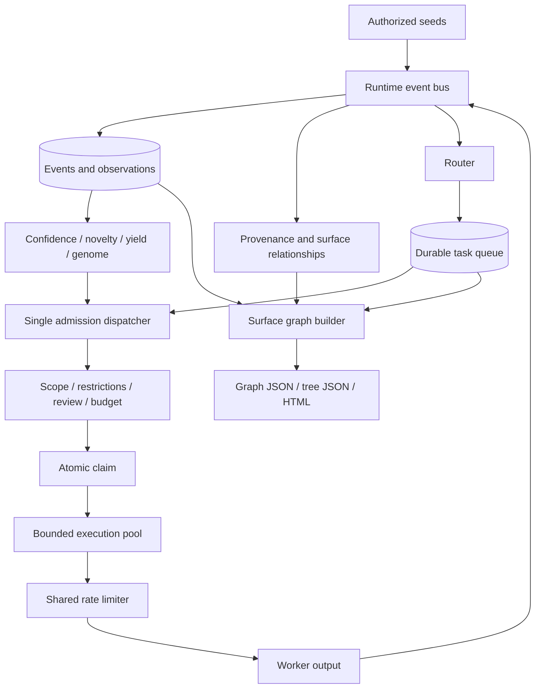

# Night Scout: Purpose and Architecture

[Back to README](../README.md) · [Русская версия](ARCHITECTURE_RU.md)

This document explains why Night Scout exists, how its major subsystems fit
together, and which invariants extensions must preserve. Operational commands
and installation belong in the [README](../README.md); exact configuration
fields belong in the versioned example YAML files.

## 1. Purpose

Reconnaissance rarely follows a straight line. A domain produces DNS records;
an HTTP response reveals a framework; a JavaScript bundle contains another API
route; a certificate names a related host; an old application exposes naming
conventions that improve later guesses. Conventional shell pipelines tend to
lose this context between tools.

Night Scout is the coordination and intelligence layer around those tools. Its
job is to:

1. accept only explicitly authorized starting points;
2. normalize every useful result into a durable observation;
3. preserve evidence and causal provenance;
4. decide which authorized follow-up has the highest expected value;
5. execute independent work concurrently within local and network limits;
6. stop when additional work no longer justifies its cost;
7. project the accumulated evidence into a readable attack-surface graph.

Night Scout deliberately does not autonomously exploit vulnerabilities, infer
authorization from technical ownership, or use discovered credentials.

## 2. Architectural invariants

The implementation is organized around a small set of non-negotiable rules.

- Scope and policy authorize work. Scores only prioritize already eligible work.
- Unknown active targets fail closed.
- A scheduler decision never executes traffic by itself.
- Every active task passes gates, budget reservation, atomic claim and shared rate limiting.
- Durable queue state is the recovery mechanism; in-memory tasks are only execution handles.
- Repeated observations merge into canonical assets without erasing their individual provenance.
- A hypothesis is not confirmed merely because it is in scope or has a high score.
- Raw secrets are isolated from ordinary events, logs, graphs and SAFE exports.
- Cancellation must leave tasks and leases recoverable.
- New intelligence may expand the frontier, but cannot expand authorization.

These rules matter more than any particular worker or scoring formula.

## 3. System overview



The project is a modular monolith. Core scheduling and lifecycle code does not
know how DNS or HTTP works. Workers do not decide scope. Storage repositories
do not rank tasks. `recon/runtime.py` is the composition root where those
independent contracts are connected.

## 4. The data model

### Events and observations

An `Event` is the normalized unit exchanged by workers and runtime services. It
contains a typed value, source, timestamps, parent reference, scope state,
confidence, novelty, depth, tags and safe metadata. Event types cover domains,
DNS records, IPs, services, URLs, certificates, technologies, parameters,
artifacts, vulnerability candidates and policy/review signals.

Event identity describes an observation role. The same real domain may appear
as a root seed, a DNS result and a certificate SAN. Those observations should
remain distinct because they answer different provenance questions.

### Canonical assets

Storage maps compatible observations to canonical assets. Assets answer “what
real thing is this?” while observations answer “who saw it, when and why?” This
separation allows deduplication without flattening history.

### Two linked graphs

Night Scout intentionally maintains two graphs:

1. The provenance graph connects observations through causal or correlational
   edges. It explains where a fact came from.
2. The surface graph connects normalized real assets through semantic edges. It
   explains what the target exposes.

Typical surface relations include `HAS_SUBDOMAIN`, `RESOLVES_TO`,
`EXPOSES_SERVICE`, `HAS_ENDPOINT`, `HAS_CHILD_PATH`, `PRESENTS_CERTIFICATE`,
`USES_TECHNOLOGY`, `HAS_PARAMETER`, `POTENTIALLY_AFFECTED_BY` and
`CONFIRMED_AFFECTED_BY`.

The internal structure remains a graph. An IP, certificate or technology can
belong to several services. Tree JSON and the HTML hierarchy select a primary
display parent and use references for additional parents; they do not rewrite
the underlying graph.

### Target Genome

The Target Genome is an explainable target-specific knowledge layer, not a
neural model. It aggregates vocabulary, naming patterns, URL structures,
historical fragments, technology combinations, successful hypotheses and
negative results. Workers may use this knowledge to generate better candidates;
the scope engine still evaluates every concrete candidate independently.

## 5. Durable ingest and routing

Workers publish normalized events through `RuntimeEventBus`. Publication has a
bounded producer queue and one local durable writer. This creates backpressure
instead of dropping events when concurrent workers finish together.

For a new observation, the writer performs the following envelope:

1. sanitize and classify the event;
2. persist or merge its observation and canonical asset;
3. append the safe event log when enabled;
4. capture primary provenance;
5. materialize supported semantic surface relationships;
6. update optional snapshots and publication metrics;
7. route the event into idempotent durable tasks.

Vocabulary and vulnerability enrichment may then publish derived events through
the same path. Recursive publication does not bypass durability or routing.
Queue metrics expose current depth, high-water mark, average write duration and
observed SQLite busy failures.

## 6. Queue, scheduler and lifecycle

The router converts an event into task proposals. A task references its input
event rather than embedding the event payload. Its deduplication key combines
worker, action and logical input identity.

The scheduler ranks a bounded ready shortlist using route priority, confidence,
novelty, expected yield, information gain, estimated cost, retry penalty and
age. Rankings are persisted for `nightscout explain`. Worker-fair batch
selection prevents one abundant task class from monopolizing every slot.

Ranking is not admission. `Lifecycle` separates the process into two phases:

```text
admit(schedule)
    gates → budget reserve → atomic queue claim → DispatchTicket

execute_claimed(ticket)
    heartbeat → worker → result → queue/budget/attempt finalization
```

A `DispatchTicket` contains the claimed task, schedule decision, claim fence,
attempt attribution and budget reservation. Claim tokens prevent a stale worker
from finalizing a newer attempt after lease recovery.

Pre-claim outcomes such as scope block, review or budget defer produce explicit
durable states. Unexpected executor failures conservatively consume reserved
budget because target traffic may already have occurred.

## 7. Parallel execution and backpressure

One dispatcher owns admission inside a process. It ranks a batch, respects free
global and per-worker capacity, admits tasks sequentially, and executes claimed
tickets in an `asyncio.TaskGroup`. It waits for `FIRST_COMPLETED` before filling
newly available slots.

`execution_concurrency` protects the local machine and SQLite. Network policy is
separate: shared token/concurrency buckets protect the target across different
workers. Increasing the execution pool therefore does not grant additional
network authority.

One `max_steps` unit is one successfully claimed task passed to execution.
IDLE, stale decisions, gate deferrals and local-capacity waits do not consume a
step. The dispatcher stops admitting at the limit and drains work it already
claimed.

The model default is sequential execution (`1`). A reviewed pipeline can opt
into a larger pool and per-worker caps. Slow crawler or Nuclei processes should
not occupy all capacity while DNS or HTTP work is ready.

Temporary budget-capacity misses are internal dispatcher backpressure. They
defer the queue item until capacity can be released, but are not execution
attempts, do not consume `max_steps`, and are not emitted as repetitive STEP
progress. After a batch encounters backpressure, admission waits for active
work to complete before selecting another batch.

## 8. Shared rate limiting

`RateLimiter` is the single policy layer above tool-local flags. A request may
match several global and per-resource rules; the atomic store applies the most
restrictive combination.

Request-aware Python workers acquire permits close to network I/O. Opaque
multi-request subprocesses acquire a concurrency lease before launch and
receive `safe_rps_hint`, which divides shared RPS when concurrent consumers are
possible. Tools that cannot express a safe rate fail closed or use a slower
delay form.

`await_acquire()` sleeps cancelably for the store-provided retry interval and
wakes early when a local lease is released. This avoids hot durable retry loops.
Every acquired concurrency lease is released in `finally`; expired leases are
reaped after crashes.

## 9. Scope and policy

Scope configuration answers where the operator is authorized to work. Pipeline
configuration answers how Night Scout may work there.

Rules classify concrete subjects such as domains, IP addresses, CIDRs and
mobile application identifiers. Exact rules and wildcards retain their literal
meaning. Higher-priority exclusions win. A wildcard may create a passive apex
discovery anchor without silently authorizing active work on that apex.

Before execution, independent gates cover:

- scope and active/passive activity type;
- explicit program restrictions;
- convergence and cooldown state;
- human-review triggers;
- cost/request/runtime/candidate budgets.

Workers repeat scope checks where output can redirect or expand to a new
network target. HTTP redirects, certificate names, archived hosts and mobile
strings are therefore observations first, authorization never.

## 10. Workers

Workers implement a narrow contract: load the input event, validate the action,
perform bounded work, publish normalized output, and return a structured
success/retry/failure result. External tools are isolated behind adapters so
their command lines, parsing and cancellation behavior remain testable.

The current worker families cover:

- passive domain discovery and archives;
- DNS resolution and target-specific permutations;
- HTTP probing, content retrieval and crawling;
- TLS certificates, ASN/IP context and virtual hosts;
- JavaScript, parameters and fingerprints;
- local APK/IPA analysis;
- audited Nuclei candidate validation.

Nuclei is not exposed as an unrestricted `-u` wrapper. Templates come from an
explicit local audited manifest, target variables are validated, and candidate
findings remain distinct from confirmed findings.

## 11. Intelligence and convergence

Confidence combines independent supporting and contradicting evidence groups;
repeated output from the same upstream source is discounted. Novelty estimates
how much an observation changes the current target model. Yield tracks useful
outputs relative to worker cost and information gain.

These signals feed scheduling and convergence only. They never alter scope.
Convergence closes or cools a branch when repeated work produces insufficient
new information, preventing recursive discovery from becoming an unbounded
scan.

Negative knowledge is retained as evidence that a candidate, path or technique
did not produce a useful result at a particular time. It suppresses wasteful
repetition but is not permanent proof of absence.

## 12. Surface graph and exports

`SurfaceRelationshipProjector` materializes unambiguous typed relationships
after durable ingest. `nightscout graph rebuild` applies the same rules to older
workspaces and is safe to preview or repeat.

`SurfaceGraphBuilder` reads assets, observations, relationships, evidence and
task coverage, then produces a deterministic immutable snapshot. It:

- collapses compatible observation roles into stable node identities;
- keeps scope, discovery and liveness as separate dimensions;
- excludes internal vocabulary from the default user projection;
- attaches each subdomain to the nearest observed DNS parent without crossing a Public Suffix boundary;
- derives service/endpoint/path presentation hierarchy without inventing ownership;
- attaches successful `HTTP_RESPONSE` evidence to the matching canonical endpoint, retaining
  the latest method/status and a bounded response history without turning responses into assets;
- reports disabled, pending, running, failed and completed investigation coverage;
- applies confidence, state, root, depth, node and edge limits;
- generates a stable content fingerprint.

Export roles are deliberately different:

- JSONL preserves event-level machine records;
- TXT and CSV provide operational lists;
- graph JSON is the canonical semantic surface contract;
- tree JSON is a rooted, cycle-safe projection with `$ref` links;
- HTML is a self-contained explorer with lazy expansion, bounded search results and no remote dependencies.

Endpoint response history is capped at the latest 25 observations in a snapshot;
`history_total` and `history_truncated` make that limit explicit. Probe failures
without an HTTP status remain negative evidence and cannot create or confirm an
endpoint. The HTML explorer renders status-family badges and exposes redirects
and the bounded history in the node details panel.

Target-controlled strings are inserted as text, and embedded JSON escapes HTML
script delimiters. Raw sensitive evidence is not part of surface snapshots.

## 13. Persistence and workspaces

SQLite is the source of truth for events, assets, relationships, evidence,
tasks, attempts, scheduler/policy decisions, budgets, rate buckets, runs,
reviews, snapshots and intelligence state. WAL mode and a busy timeout support
the bounded concurrent runtime; the event writer further reduces contention.

Each physical workspace is bound to one stable `target_id`. Several authorized
domains from the same program may share it. Different programs must use
different target identities. A populated legacy database without trustworthy
attribution requires explicit `nightscout workspace adopt` confirmation.

Alembic upgrades the schema before the async engine opens. Compatible legacy
databases can be stamped conservatively; ambiguous or incompatible state fails
closed rather than being rewritten heuristically.

## 14. Cancellation and recovery

Queue claims and budget/rate reservations use expiring leases and heartbeat
renewal. If either authoritative lease is lost, worker execution is cancelled
to prevent duplicate or unbudgeted traffic.

On operator cancellation, admission stops. Active workers receive the configured
shutdown grace period; after it expires, their execution is cancelled and
subprocess adapters terminate child process groups. Claimed tasks are finalized
or returned to a retryable durable state, reservations are committed or
released conservatively, and the run is recorded as `PAUSED`. Startup reaps any
leases left by an unclean process death.

Streaming subprocess timeouts are scoped only to adapter I/O and never remain
active across an async-generator `yield`; result publication therefore cannot
be mistaken for a tool timeout. A child executor that nevertheless terminates
with `CancelledError` is contained as a retryable task failure, while only an
actual cancellation of the owning lifecycle is treated as operator/runtime
shutdown.

## 15. Configuration boundaries

The two primary documents have separate responsibilities:

- `scope.yaml`: target identity, exact authorization, wildcards and exclusions;
- `pipeline.yaml`: runtime, workers, routing, rate limits, budgets, storage, intelligence and exports.

Pydantic models reject unknown structural fields. The canonical references are
[`configs/scope.example.yaml`](../configs/scope.example.yaml) and
[`configs/pipeline.example.yaml`](../configs/pipeline.example.yaml). Secrets and
program-specific identity headers should be supplied through the supported
runtime mechanisms, not copied into documentation or committed configuration.

## 16. Extending the system

A new event-producing worker should normally require:

1. one or more event types already supported by the core model, or a deliberate model extension;
2. a worker adapter with bounded parsing and subprocess cleanup;
3. router rules that create idempotent tasks;
4. scope and rate-limit context for every possible network target;
5. budget demand and scheduler cost estimates;
6. provenance/surface projection rules where the relationship is unambiguous;
7. unit tests plus a fake-backend integration path;
8. documented pipeline defaults.

Do not place authorization in a worker, scoring in storage, or tool-specific
logic in lifecycle. New persistent fields require an Alembic migration.

## 17. Repository map

```text
recon/
├── core/          events, routing, queue, scheduler, budgets, lifecycle
├── policy/        scope, restrictions, review, rate limits, request identity
├── workers/       bounded adapters for discovery and analysis tools
├── intelligence/ confidence, novelty, yield, vocabulary, patterns, convergence
├── storage/       SQLAlchemy repositories, schema and provenance
├── surface/       canonical graph identity, projection, rebuild and tree view
├── exporters/     JSONL, TXT, CSV and surface graph outputs
├── runtime.py     composition root and durable dispatcher
└── cli.py         user-facing command interface

migrations/        Alembic revisions
configs/           canonical scope and pipeline examples
scripts/           release, tool-management and wordlist utilities
tests/             policy, storage, runtime, worker and packaging regression tests
```

## 18. Verification and distribution

Normal tests use in-memory stores, temporary SQLite workspaces and fake
subprocess adapters; they must not contact reconnaissance targets. The release
gate covers policy precedence, migrations, claim fencing, cancellation, shared
rate limits, concurrent ingest, graph safety, secret redaction and package
contents.

Night Scout remains Python 3.12+ internally. Releases use a PyInstaller
one-folder runtime packaged as `.deb`; companion reconnaissance binaries remain
separate, manifest-managed tools. Official host support is Debian 13+ and
current Kali Linux on `amd64` and `arm64`.
