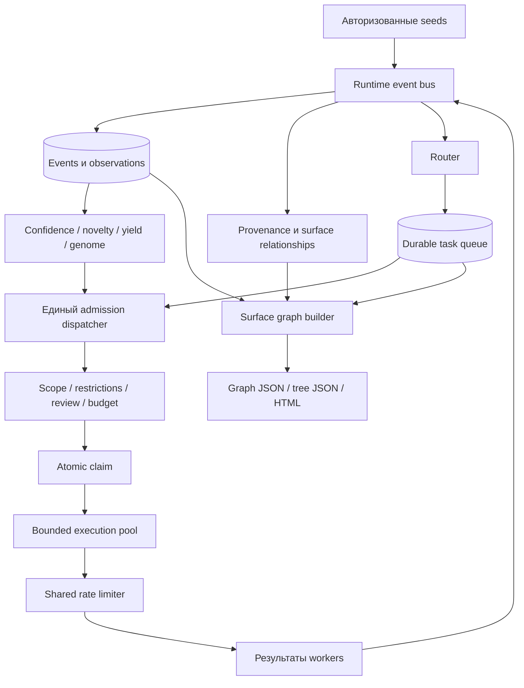

# Night Scout: цель и архитектура

[Вернуться к README](../README_RU.md) · [English version](ARCHITECTURE.md)

Этот документ объясняет назначение Night Scout, взаимодействие его основных
подсистем и инварианты, которые должны сохранять расширения. Установка и
повседневные команды находятся в [README](../README_RU.md), а точные поля
конфигурации — в версионируемых YAML-примерах.

## 1. Назначение

Разведка редко идёт по прямой. Домен создаёт DNS-записи; HTTP-ответ раскрывает
framework; JavaScript содержит новый API route; сертификат называет связанный
host; старое приложение показывает naming conventions, улучшающие следующие
гипотезы. Обычные shell pipelines часто теряют этот контекст между tools.

Night Scout — координационный и интеллектуальный слой вокруг таких tools. Его
задачи:

1. принимать только явно авторизованные starting points;
2. нормализовать каждый полезный результат в durable observation;
3. сохранять evidence и causal provenance;
4. выбирать наиболее ценное разрешённое продолжение;
5. параллельно выполнять независимую работу в локальных и сетевых пределах;
6. останавливаться, когда новая работа перестаёт оправдывать стоимость;
7. превращать накопленные evidence в понятный граф поверхности атаки.

Night Scout намеренно не эксплуатирует уязвимости автономно, не выводит
разрешение из технического ownership и не использует найденные credentials.

## 2. Архитектурные инварианты

Реализация строится вокруг нескольких обязательных правил.

- Scope и policy разрешают работу. Scores только ранжируют уже допустимую работу.
- Неизвестные active targets блокируются.
- Решение scheduler само по себе не создаёт traffic.
- Каждая active task проходит gates, budget reservation, atomic claim и shared rate limit.
- Durable queue — механизм восстановления; in-memory tasks лишь handles исполнения.
- Повторные observations объединяются в canonical assets без потери собственного provenance.
- Hypothesis не становится confirmed из-за scope или высокого score.
- Raw secrets изолированы от обычных events, logs, graphs и SAFE exports.
- Cancellation обязана оставить tasks и leases восстанавливаемыми.
- Новые intelligence-сигналы могут расширить frontier, но не authorization.

Эти правила важнее конкретного worker или формулы scoring.

## 3. Общая схема



Проект является modular monolith. Core scheduling и lifecycle не знают, как
работают DNS или HTTP. Workers не определяют scope. Storage repositories не
ранжируют tasks. `recon/runtime.py` — composition root, соединяющий независимые
контракты.

## 4. Модель данных

### Events и observations

`Event` — нормализованная единица обмена между workers и runtime services. Он
содержит typed value, source, timestamps, parent reference, scope state,
confidence, novelty, depth, tags и безопасные metadata. Event types описывают
домены, DNS records, IP, services, URLs, certificates, technologies, parameters,
artifacts, vulnerability candidates и policy/review signals.

Event identity описывает роль observation. Один реальный домен может появиться
как root seed, DNS result и certificate SAN. Эти observations остаются
раздельными, поскольку отвечают на разные provenance-вопросы.

### Canonical assets

Storage связывает совместимые observations с canonical assets. Asset отвечает
на вопрос «что это за реальный объект?», observation — «кто, когда и почему его
увидел?». Это позволяет дедупликацию без уничтожения истории.

### Два связанных графа

Night Scout намеренно поддерживает два графа:

1. Provenance graph связывает observations causal или correlational edges и
   объясняет происхождение факта.
2. Surface graph связывает нормализованные реальные assets semantic edges и
   объясняет фактическую поверхность target.

Типичные surface relations: `HAS_SUBDOMAIN`, `RESOLVES_TO`, `EXPOSES_SERVICE`,
`HAS_ENDPOINT`, `HAS_CHILD_PATH`, `PRESENTS_CERTIFICATE`, `USES_TECHNOLOGY`,
`HAS_PARAMETER`, `POTENTIALLY_AFFECTED_BY` и `CONFIRMED_AFFECTED_BY`.

Внутренняя структура остаётся графом. Один IP, certificate или technology может
относиться к нескольким services. Tree JSON и HTML-иерархия выбирают основной
display parent и используют references для дополнительных родителей, не
переписывая исходный граф.

### Target Genome

Target Genome — объяснимый target-specific knowledge layer, а не neural model.
Он агрегирует vocabulary, naming patterns, URL structures, historical
fragments, technology combinations, успешные hypotheses и negative results.
Workers могут использовать эти знания для лучших candidates, но scope engine
по-прежнему независимо оценивает каждый конкретный candidate.

## 5. Durable ingest и routing

Workers публикуют нормализованные events через `RuntimeEventBus`. Публикация
имеет bounded producer queue и один локальный durable writer. Если несколько
workers заканчивают одновременно, возникает backpressure, а не потеря events.

Для нового observation writer выполняет следующий envelope:

1. sanitization и classification event;
2. сохранение или merge observation и canonical asset;
3. запись безопасного event log, если он включён;
4. сохранение primary provenance;
5. materialization подтверждённых semantic surface relationships;
6. обновление optional snapshots и publication metrics;
7. routing event в idempotent durable tasks.

Vocabulary и vulnerability enrichment затем могут публиковать derived events
тем же путём. Рекурсивная публикация не обходит durability или routing. Queue
metrics показывают текущую глубину, high-water mark, среднее время записи и
зафиксированные SQLite busy failures.

## 6. Queue, scheduler и lifecycle

Router превращает event в task proposals. Task ссылается на input event, а не
копирует его payload. Dedupe key объединяет worker, action и logical input
identity.

Scheduler ранжирует bounded ready shortlist по route priority, confidence,
novelty, expected yield, information gain, estimated cost, retry penalty и age.
Rankings сохраняются для `nightscout explain`. Worker-fair batch selection не
позволяет одному массовому классу задач занять все slots.

Ranking не является admission. `Lifecycle` разделяет процесс на две фазы:

```text
admit(schedule)
    gates → budget reserve → atomic queue claim → DispatchTicket

execute_claimed(ticket)
    heartbeat → worker → result → queue/budget/attempt finalization
```

`DispatchTicket` содержит claimed task, schedule decision, claim fence, attempt
attribution и budget reservation. Claim token не позволяет stale worker
завершить более новую попытку после lease recovery.

Pre-claim outcomes — scope block, review или budget defer — получают явное
durable state. Неожиданный executor failure консервативно расходует reserved
budget, потому что target traffic уже мог произойти.

## 7. Параллельное исполнение и backpressure

Внутри процесса admission принадлежит одному dispatcher. Он ранжирует batch,
учитывает свободную global и per-worker capacity, последовательно допускает
tasks и исполняет claimed tickets внутри `asyncio.TaskGroup`. Новые slots
заполняются после ожидания `FIRST_COMPLETED`.

`execution_concurrency` защищает локальную машину и SQLite. Network policy
отделена: общие token/concurrency buckets защищают target сразу для разных
workers. Увеличение execution pool не выдаёт дополнительных сетевых разрешений.

Один `max_steps` — одна успешно claimed task, переданная в execution. IDLE,
stale decisions, gate deferrals и ожидание локальной capacity шаг не расходуют.
Достигнув лимита, dispatcher прекращает admission и дожидается уже claimed work.

Default модели — последовательное исполнение (`1`). Проверенный pipeline может
увеличить pool и задать per-worker caps. Медленные crawler или Nuclei processes
не должны занимать всю capacity при готовых DNS или HTTP tasks.

Временная нехватка budget capacity считается внутренним backpressure
dispatcher. Queue item откладывается до освобождения capacity, но это не
execution attempt, такой ответ не расходует `max_steps` и не печатается как
повторяющийся STEP progress. Встретив backpressure в batch, dispatcher ожидает
завершения активной работы перед следующим admission.

## 8. Общий rate limiting

`RateLimiter` — единый policy layer над локальными flags инструментов. Один
request может соответствовать нескольким global и per-resource rules; atomic
store применяет наиболее строгое сочетание.

Request-aware Python workers получают permit близко к фактическому network I/O.
Opaque multi-request subprocesses резервируют concurrency lease до запуска и
получают `safe_rps_hint`, делящий общий RPS между возможными consumers. Tools,
не способные безопасно выразить rate, работают медленнее или fail closed.

`await_acquire()` отменяемо ждёт store-provided retry interval и просыпается
раньше при освобождении локального lease. Это устраняет горячие durable retry
loops. Каждый concurrency lease освобождается в `finally`, а после crash
просроченные leases собираются recovery-процедурой.

## 9. Scope и policy

Scope configuration отвечает, где оператору разрешена работа. Pipeline
configuration отвечает, как Night Scout может работать в этих границах.

Rules классифицируют конкретные subjects: domains, IP addresses, CIDRs и mobile
application identifiers. Exact rules и wildcards сохраняют буквальное значение;
более приоритетные exclusions побеждают. Wildcard может создать passive apex
discovery anchor, не разрешая автоматически active work по apex.

До execution независимые gates проверяют:

- scope и active/passive activity type;
- явные program restrictions;
- convergence и cooldown state;
- human-review triggers;
- budgets стоимости, requests, runtime и candidates.

Workers повторяют scope checks, если output способен перенаправить или расширить
network target. HTTP redirects, certificate names, archived hosts и mobile
strings сначала являются observations и никогда — authorization.

## 10. Workers

Worker реализует узкий контракт: загрузить input event, проверить action,
выполнить bounded work, опубликовать нормализованный output и вернуть
структурированный success/retry/failure. Внешние tools изолированы adapters,
чтобы command lines, parsing и cancellation можно было тестировать.

Текущие семейства workers покрывают:

- passive domain discovery и archives;
- DNS resolution и target-specific permutations;
- HTTP probing, content retrieval и crawling;
- TLS certificates, ASN/IP context и virtual hosts;
- JavaScript, parameters и fingerprints;
- локальный анализ APK/IPA;
- audited Nuclei candidate validation.

Nuclei не доступен как неограниченный `-u` wrapper. Templates берутся из
явного локального audited manifest, target variables валидируются, а candidate
findings остаются отличимыми от confirmed findings.

## 11. Intelligence и convergence

Confidence объединяет независимые supporting и contradicting evidence groups;
повторный output одного upstream source дисконтируется. Novelty оценивает,
насколько observation меняет текущую модель target. Yield отслеживает полезный
output относительно worker cost и information gain.

Эти сигналы влияют только на scheduling и convergence, но не на scope.
Convergence закрывает или охлаждает branch, когда повторная работа приносит
недостаточно новой информации, не давая рекурсивному поиску стать бесконечным.

Negative knowledge сохраняет evidence, что candidate, path или technique не
дали полезного результата в конкретный момент. Оно подавляет бесполезные
повторы, но не является вечным доказательством отсутствия.

## 12. Surface graph и exports

`SurfaceRelationshipProjector` материализует однозначные typed relationships
после durable ingest. `nightscout graph rebuild` применяет те же правила к
старым workspaces; команду безопасно предварительно или повторно запускать.

`SurfaceGraphBuilder` читает assets, observations, relationships, evidence и
task coverage и создаёт deterministic immutable snapshot. Он:

- объединяет совместимые observation roles в stable node identities;
- хранит scope, discovery и liveness раздельно;
- исключает внутренний vocabulary из default user projection;
- связывает subdomain с ближайшим observed DNS parent, не переходя Public Suffix boundary;
- выводит service/endpoint/path presentation hierarchy, не выдумывая ownership;
- прикрепляет успешные `HTTP_RESPONSE` evidence к соответствующему canonical endpoint,
  сохраняя последний method/status и ограниченную историю ответов, но не превращая
  responses в самостоятельные assets;
- показывает disabled, pending, running, failed и completed coverage;
- применяет confidence, state, root, depth, node и edge limits;
- создаёт стабильный content fingerprint.

Назначение export-форматов различается:

- JSONL сохраняет event-level machine records;
- TXT и CSV дают operational lists;
- graph JSON — canonical semantic surface contract;
- tree JSON — rooted cycle-safe projection с `$ref` links;
- HTML — автономный explorer с lazy expansion, bounded search results и без remote dependencies.

История ответов endpoint ограничена последними 25 наблюдениями в snapshot;
`history_total` и `history_truncated` явно отражают это ограничение. Probe failures
без HTTP status остаются negative evidence и не могут создать или подтвердить
endpoint. HTML explorer показывает цветные status-family badges, redirects и
ограниченную историю в панели подробностей узла.

Target-controlled строки вставляются как text, а embedded JSON экранирует HTML
script delimiters. Raw sensitive evidence не входит в surface snapshots.

## 13. Persistence и workspaces

SQLite — source of truth для events, assets, relationships, evidence, tasks,
attempts, scheduler/policy decisions, budgets, rate buckets, runs, reviews,
snapshots и intelligence state. WAL mode и busy timeout поддерживают bounded
concurrent runtime, а event writer дополнительно уменьшает contention.

Каждый physical workspace связан с одним стабильным `target_id`. Несколько
разрешённых доменов одной программы могут делить workspace; разные программы
обязаны иметь разные target identities. Заполненная legacy database без
достоверной attribution требует явного `nightscout workspace adopt`.

Alembic обновляет schema до открытия async engine. Совместимая legacy database
может быть консервативно stamped; неоднозначное или несовместимое состояние
fail closed вместо эвристического rewrite.

## 14. Cancellation и recovery

Queue claims и budget/rate reservations используют expiring leases и heartbeat
renewal. При потере любого authoritative lease worker отменяется, чтобы не
допустить duplicate или unbudgeted traffic.

При operator cancellation прекращается admission. Active workers получают
настроенный shutdown grace period; затем execution отменяется, а subprocess
adapters завершают дочерние process groups. Claimed tasks финализируются или
возвращаются в retryable durable state, reservations консервативно commit или
release, а run получает статус `PAUSED`. При startup собираются leases,
оставшиеся после нештатного завершения процесса.

Timeout потокового subprocess ограничен только adapter I/O и никогда не остаётся
активным через async-generator `yield`, поэтому публикация результата не может
быть ошибочно принята за timeout инструмента. Если child executor всё же
завершается с `CancelledError`, отмена изолируется как retryable task failure;
operator/runtime shutdown определяется только отменой owning lifecycle.

## 15. Границы конфигурации

Два главных документа имеют разные обязанности:

- `scope.yaml`: target identity, exact authorization, wildcards и exclusions;
- `pipeline.yaml`: runtime, workers, routing, rate limits, budgets, storage, intelligence и exports.

Pydantic models отклоняют неизвестные structural fields. Canonical references:
[`configs/scope.example.yaml`](../configs/scope.example.yaml) и
[`configs/pipeline.example.yaml`](../configs/pipeline.example.yaml). Secrets и
program-specific identity headers следует передавать штатными runtime
механизмами, а не помещать в документацию или committed configuration.

## 16. Расширение системы

Новый event-producing worker обычно требует:

1. существующих event types либо осознанного расширения core model;
2. worker adapter с bounded parsing и subprocess cleanup;
3. router rules, создающих idempotent tasks;
4. scope и rate-limit context для каждого возможного network target;
5. budget demand и scheduler cost estimates;
6. provenance/surface projection rules для однозначных relationships;
7. unit tests и integration path с fake backend;
8. документированных pipeline defaults.

Не следует помещать authorization в worker, scoring в storage или
tool-specific logic в lifecycle. Новые persistent fields требуют Alembic
migration.

## 17. Карта репозитория

```text
recon/
├── core/          events, routing, queue, scheduler, budgets, lifecycle
├── policy/        scope, restrictions, review, rate limits, request identity
├── workers/       bounded adapters для discovery и analysis tools
├── intelligence/ confidence, novelty, yield, vocabulary, patterns, convergence
├── storage/       SQLAlchemy repositories, schema и provenance
├── surface/       canonical graph identity, projection, rebuild и tree view
├── exporters/     JSONL, TXT, CSV и surface graph outputs
├── runtime.py     composition root и durable dispatcher
└── cli.py         пользовательский command interface

migrations/        Alembic revisions
configs/           canonical scope и pipeline examples
scripts/           release, tool-management и wordlist utilities
tests/             policy, storage, runtime, worker и packaging regression tests
```

## 18. Проверка и поставка

Обычные tests используют in-memory stores, временные SQLite workspaces и fake
subprocess adapters; они не должны обращаться к recon targets. Release gate
проверяет policy precedence, migrations, claim fencing, cancellation, shared
rate limits, concurrent ingest, graph safety, secret redaction и package
contents.

Внутри Night Scout остаётся Python 3.12+ проектом. Release использует
PyInstaller one-folder runtime в `.deb`; специализированные recon binaries
остаются отдельными manifest-managed tools. Официально поддерживаются Debian
13+ и актуальный Kali Linux на `amd64` и `arm64`.
